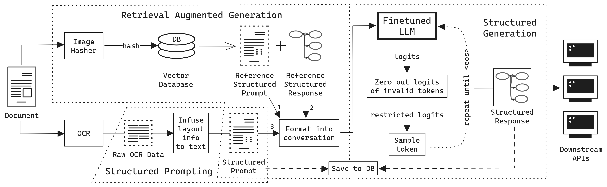

Authors: [Franz Louis Cesista](mailto:franzlouiscesista@gmail.com), Rui Aguiar, Jason Kim, Paolo Acilo

Arxiv: [Abstract](https://arxiv.org/abs/2405.20245)

PDF: [Preprint - Accepted @ IEEE MIPR 2024](/rasg.pdf)

Code on GitHub: [Will be available on or before June 17th, 2024]

---

## Abstract

Business Document Information Extraction (BDIE) is the problem of transforming a blob of unstructured information (raw text, scanned documents, etc.) into a structured format that downstream systems can parse and use. It has two main tasks: Key-Information Extraction (KIE) and Line Items Recognition (LIR). In this paper, we argue that BDIE is best modeled as a Tool Use problem, where the tools are these downstream systems. We then present Retrieval Augmented Structured Generation (RASG), a novel general framework for BDIE that achieves state of the art (SOTA) results on both KIE and LIR tasks on BDIE benchmarks.

The contributions of this paper are threefold:

1. We show, with ablation benchmarks, that Large Language Models (LLMs) with RASG are already competitive with or surpasses current SOTA Large Multimodal Models (LMMs) without RASG on BDIE benchmarks.
2. We propose a new metric class for Line Items Recognition, General Line Items Recognition Metric (GLIRM), that is more aligned with practical BDIE use cases compared to existing metrics, such as ANLS*, DocILE, and GriTS.
3. We provide a heuristic algorithm for backcalculating bounding boxes of predicted line items and tables without the need for vision encoders.

Finally, we claim that, while LMMs might sometimes offer marginal performance benefits, LLMs + RASG is oftentimes superior given real-world applications and constraints of BDIE.

## Citation

```bibtex
@misc{cesista2024rasg,
    title={Retrieval Augmented Structured Generation: Business Document Information Extraction As Tool Use},
    author={Franz Louis Cesista, Rui Aguiar, Jason Kim, Paolo Acilo},
    year={2024},
    eprint={2405.20245},
    archivePrefix={arXiv},
    primaryClass={cs.CL}
}
```
