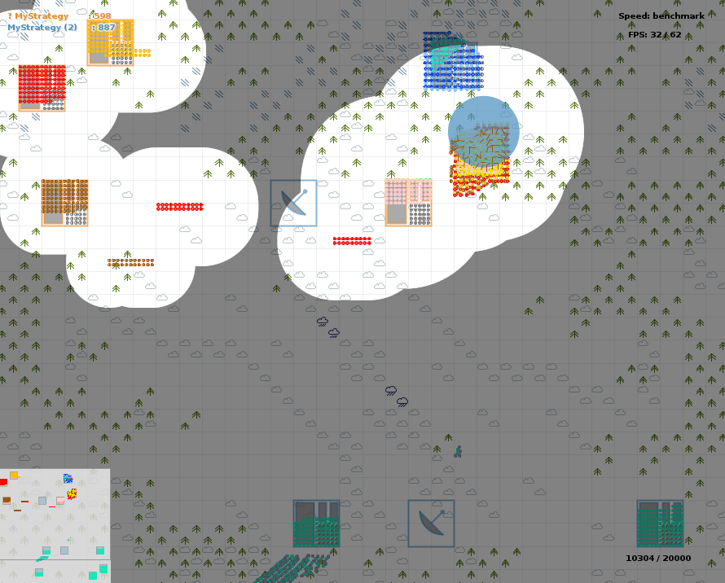

My entry for the World Finals of the Russian AI Cup 2017 - Codewars. A particle swarm-based AI that uses potential flows and fluid mechanics to direct units in a Command-and-Conquer-esque game.

## Game Mechanics

CodeWars is a Command-and-Conquer-esque game where we and our enemy have hundreds of units of different types. The unit types are kind-of like rock-paper-and-scissor: a unit type can easily beat some types while weak to other types. Each enemy kill is worth 1 point and our goal is to either (a) kill all enemy units or (b) get a higher score than our opponent when the timer runs out.

In the later stages, fog-of-war gets activated and Facilities appear on the map. Capturing them gives us 50 points and holding them long enough gives us new units that'd spawn near the Facilities. We could also launch nukes from time to time.

Finally, we are only allowed to do at most 60 actions per second.

## Techniques Used in My Strategy

### 1. K-Means Clustering

The 60 actions-per-second rule makes it infeasible to manage our forces with precise granularity. And thus, we need to divide them into "army groups" that behave as if they're a single unit. Most of our opponents do this too, but they don't (and can't) tell us which units belong to which groups. And so, we have to guess the groupings with K-means clustering.

### 2. State-Space Breadth-First Search

After grouping our units, we then do a state-space search using BFS to find the optimal initial positions before launching our offensives. Note: we only use BFS to rearrange our army groups, not to find the perfect attack paths for them.

### 3. Potential Flows

Finally, even with the groupings, it's impossible to make a strategy that takes into account all possible permutations of allied & enemy positions. Thus, we need to rely on heuristics. One such heuristic is by modelling the stuff in the game map as particles that produce potential fields. All of our army groups (and stronger enemy groups) are negatively charged - thus, they repel each other. While our targets (facilities & weaker enemy groups) attract each other. We calculate this potential field for each group. And voilà, we now have a direction field for our units.
