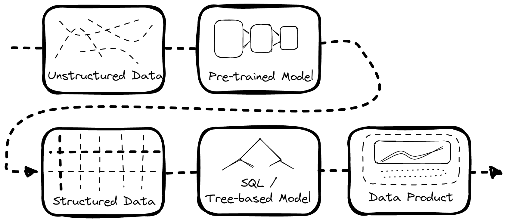
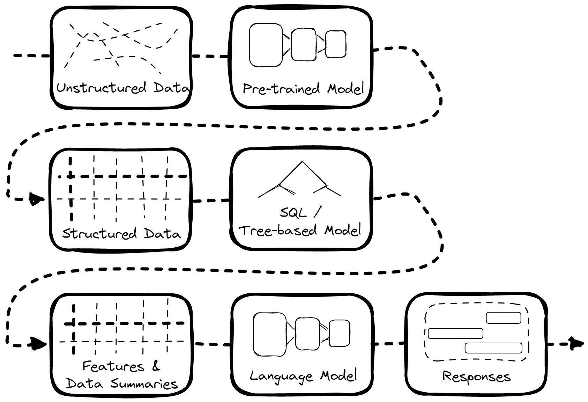
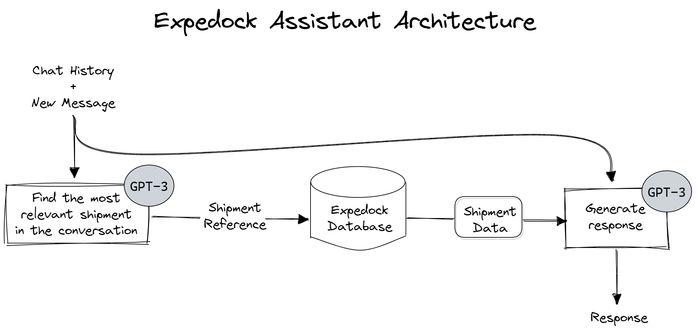

Expedock Assistant is a chatbot that allows you to ask questions about your shipments and get answers in real time. It’s like having a personal assistant that knows everything about your business, shipments and industry. When using this tool, the vast knowledge base and conversational skills of ChatGPT can alleviate some of the complexities of the logistics industry.

Watch the demo below to see how it works:



## Motivation

Here at Expedock, we are aiming to build the data infrastructure of the logistics industry. We believe that the way that people will interact with data across all industries, including but not limited to the logistics one, will fundamentally shift in the coming years. Natural language interface and tooling is becoming exponentially more powerful and intuitive every year, and we believe that this will be one of the key ways people interface with their data in the future.

In this article, we also want to give you an overview of the data landscape in the logistics industry so you could understand why we do what we do in Expedock and why we encourage experiments such as this one.

## Context

The data landscape in the logistics industry is maddeningly messy. There are millions of data formats, from unstructured or semi-structured data sources such as emails, scanned documents, database connections, excel files, and more. Worse: each company has its own processes and quirks that make interoperability a huge challenge.

As an example, there may be cases where a company submits a manually filled-in document to a port authority. The port authority manually transcribes the fields in the document to their system. The company then physically prints it and send it to a connecting business who does the exact same thing. This then repeats for dozens of parties involved in making a delivery happen. It’s so inefficient it’s bizarre how an industry as conscious about efficiency as logistics could still be stuck in this antiquated way to move data.

There are many reasons as to why this inefficiency occurs. One is that the nature of the industry is highly fragmented. There are a lot of participants (countries & companies) and each country has its own rules and regulations. Some of these rules are enforced strictly, some are not, and some are not even written. But the crux is that the margins in the industry are generally low, that every bit of advantage is valuable, and every bit of investment is expensive. Shifting to a more standardized data format could not only block them from offering a differentiated (but more inefficient) service, but it could also cause disruptions to their operations and customer service — which are the two things that you absolutely cannot get wrong when moving goods. These factors lead everyone to be stuck in a suboptimal equilibrium.

We can’t nudge our partners to change their data formats and processes due to the reasons above. So, we instead build tools to parse and structure whatever data we get from them from a multitude of formats and use that to build products that our customers can use to improve their operations, get new business, cut costs, and more.

## Making Sense of Unstructured Data

As mentioned above, not all of the data we receive is already structured. Much is unstructured, like emails, scanned documents, handwritten documents, etc. And so, one way to make them useful is to convert them into structured data first.

There are two extremes on how to do this:

1. Hire a bunch of people to manually convert the data into structured data. Doing only this takes a lot of time and money. But humans are generally accurate and reliable.

2. Build a machine learning model to convert the data into structured data. Doing only this is a lot cheaper and faster (which is what we want to be profitable). But ML models are generally only somewhat accurate & somewhat reliable.

So, we do a combination of both.

We have an internal job management system where we convert unusable unstructured data into more sane structured data with the help of a series of Multimodal Machine learning models and hired humans in the loop to verify the results. We then pipe the resulting data back to our customers and into our own data products, as illustrated above.

## The Natural Extension: Natural Language Interface

Let’s go back to the data pipeline above. Notice that all of the data processing steps are at least partially automated — except for the actual interface between the customer and their data. This currently requires expensive and time-consuming visualizations to be put together, with new use cases having to be manually programmed into a graph or webpage.

So, the next natural question is: can we automate customer interface with the supply chain data we process?

This is where Expedock Assistant comes in.

With Expedock Assistant, we can skip the process of building visualizations for not-so-common questions and just pipe the data into a Large Language Model (LLM) like OpenAI’s GPT-3 and let it answer questions for us.

## How Expedock Assistant Works

For the first iteration of this assistant, we are only piping shipment data to the chatbot. Every time a customer asks a question about a shipment, the chatbot does the following:

First, it tries to find the most relevant shipment in the conversation based on the context. It does this with a combination of heuristics given the prompt and an API call to GPT-3.

Then, it queries our database for the shipment’s data.

Finally, it pipes the conversation context and the shipment data to GPT-3 to generate a response.

That’s it!

## The Trade-offs When using Language Models

There are, of course, trade-offs to this approach to automated data interface.

Some of them include:

1. **Generality vs. Accuracy**: Expedock Assistant is only as good as GPT-3 and the heuristics we use to tame it. GPT-3 is a general-purpose language model which is very good at answering questions based on the given context. However, it sometimes "hallucinates" answers that are not true but still answers confidently with wrong information. To address this, we could fine-tune the model further or add other heuristics. However, it may overfit to answering only the kind of questions we fine-tune it on and become less general for other hard-to-answer questions.

2. **Accuracy vs. Cost**: GPT-3 is one of the best language models out there. But it’s also expensive to use. When building a language interface, there is a tradeoff to be made in using a cheaper model or building one in-house, at the potential drawback of accuracy taking a hit. As open-source language models become more prevalent, the balance may shift here.

3. **Simplicity vs. Information Bandwidth**: Chatbots are more intuitive to use than dashboards. However, they also limit the amount of information we can show. They also force users to articulate their questions properly. Dashboards or visualizations, on the other hand, can answer questions that users don’t even know they have. In engineering terms, chatbots and dashboards are like L3 and L1 cache, respectively, but with humans as processors.

## Possible Directions

There are a couple directions we can go from here. One is that we could limit the scope of Expedock Assistant to only as a kind of concierge service we could use to point our customers to the right visualizations, or to answer questions that are not yet supported by our visualizations. Another direction is that we could expand the model to be able to build custom queries and data visualizations to answer any question our customers would have. We could even let it to search external data sources, such as the entire internet or large repositories of shipping data for relevant information.
