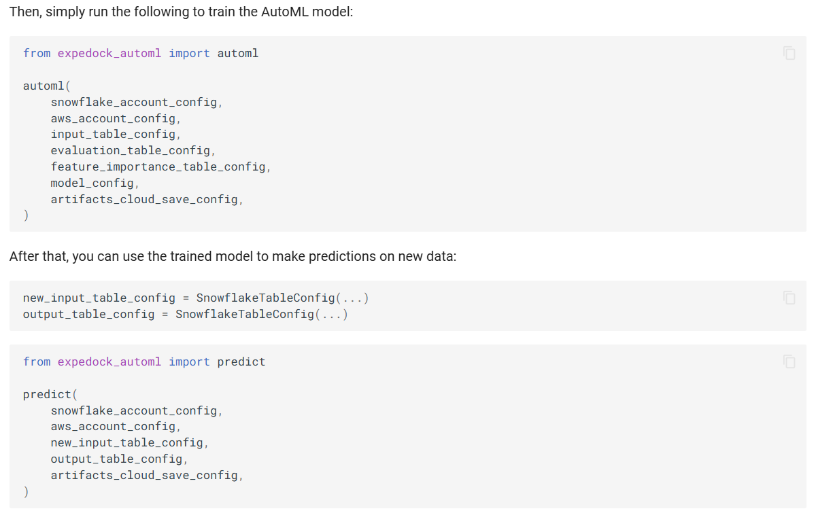

An internal AutoML library at Expedock that fits a model, runs batch inference, and gets explanations in one line of code each. The library is built on top of `scikit-learn`, `shap`, and `auto-gluon`. The library is designed to be used by non-technical users who want to quickly fit a model and get interpretability results without having to worry about the technical details.
