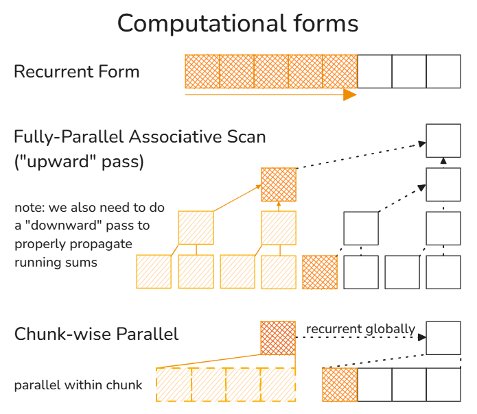

In the [previous post](../test-time-regression/), we derived several linear attention mechanisms from scratch by formulating them as test-time online regression problems. Here, we'll discuss a more intuitive way to represent the update rules of the internal states of these linear attention mechanisms using a blocked matrix formulation. Then, we'll discuss how to use it to (1) derive the update rules for linear attention mechanisms that take multiple gradient descent steps per token and (2) derive the update rules for chunk-wise parallelism of already-existing linear attention mechanisms.

## Recap: Linear Attention Mechanisms

Linear attention mechanisms typically have an update rule of the form:
$$S_i = S_{i-1}A_i + B_i$$
where $S\_{i-1}$ is the (old) state after processing the first $i-1$ tokens, $S_i$ is the (new) state after processing the first $i$ tokens, and $A_i$ and $B_i$ are update matrices. Think of $A_i$ as an operation that *modifies* some information already stored in the state while $B_i$ *adds* new information to the state. In most cases where $A_i \neq I$, $A_i$ typically *removes* some (old) information from the state. But if we allow $A_i$ to have negative eigenvalues, then we can also think of it as an operation that, in a sense, *inverts* information instead.

Here are a couple of examples:

| **Linear Attention Mechanism** |                                                                        **Update Rule** |                                   **$A_i$** |                     **$B_i$** |
| ------------------------------ | -------------------------------------------------------------------------------------: | ------------------------------------------: | ----------------------------: |
| Vanilla Linear Attention       |                                                  $S_i = S_{i-1} + \bm{v}_i \bm{k}_i^T$ |                                         $I$ |         $\bm{v}_i \bm{k}_i^T$ |
| Mamba 2                        |            $S_i = S\_{i-1}\text{diag}\left(\alpha\_i I\right) + \bm{v}\_i \bm{k}\_i^T$ |       $\text{diag}\left(\alpha\_i I\right)$ |         $\bm{v}_i \bm{k}_i^T$ |
| DeltaNet                       |         $S_i = S_{i-1}(I - \beta_i \bm{k}_i \bm{k}_i^T) + \beta_i \bm{v}_i \bm{k}_i^T$ |           $I - \beta_i \bm{k}_i \bm{k}_i^T$ | $\beta_i \bm{v}_i \bm{k}_i^T$ |
| Gated DeltaNet                 | $S_i = S_{i-1}\alpha_i(I - \beta_i \bm{k}_i \bm{k}_i^T) + \beta_i \bm{v}_i \bm{k}_i^T$ | $\alpha_i(I - \beta_i \bm{k}_i \bm{k}_i^T)$ | $\beta_i \bm{v}_i \bm{k}_i^T$ |

where $\bm{k}_i  \in \mathbb{R}^{d_k}$ and $\bm{v}_i \in \mathbb{R}^{d_v}$ are the corresponding key-value pair for the $i$-th token; $\alpha_i \in [0, 1]$ can be thought of as a date-dependent weight decay that controls how much of the previous state to keep or forget; and $\beta_i \in [0, 1]$ can be thought of as a date-dependent learning rate that controls how much of the new information to add to the state.

If we let $\alpha_i \in [-1, 1]$ for Mamba 2 and $\beta_i \in [0, 2]$ for (Gated) DeltaNet, then $A_i$ can have negative eigenvalues while still having norm $\|\|A_i\|\| \leq 1$. This allows the models to learn more complex patterns while maintaining training stability (Grazzi et al., 2025).

## Blocked Matrix Formulation of Linear Attention Mechanisms

Notice that the update rule above is just a linear transform of the state $S_{i-1}$. Thus, we can rewrite it as,

$$
\begin{align*}
    S_i &= S_{i-1}A_i + B_i\\\\
    S_{i} &=
        \begin{bmatrix}
            S_{i-1} & I
        \end{bmatrix}
        \begin{bmatrix}
            A_i \\\\
            B_i
        \end{bmatrix}
\end{align*}
$$
or, equivalently,
$$
\begin{bmatrix}
S_{i} & I
\end{bmatrix} =
\begin{bmatrix}
S_{i-1} & I
\end{bmatrix}
\begin{bmatrix}
A_i & 0 \\\\
B_i & I
\end{bmatrix}
$$

Now, at training time, we need *all* of the intermediary states, not just the final state. Thus, we need an efficient way to compute $S_N$ for all token indices $N$. To do this, let's unroll the recurrence above:

$$
\begin{align*}
\begin{bmatrix}
S_{N} & I
\end{bmatrix} &=
\begin{bmatrix}
S_{N-1} & I
\end{bmatrix}
\begin{bmatrix}
A_N & 0 \\\\
B_N & I
\end{bmatrix}\\\\
\begin{bmatrix}
S_{N} & I
\end{bmatrix} &=
\begin{bmatrix}
S_{N-2} & I
\end{bmatrix}
\begin{bmatrix}
A\_{N-1} & 0 \\\\
B\_{N-1} & I
\end{bmatrix}
\begin{bmatrix}
A_N & 0 \\\\
B_N & I
\end{bmatrix}\\\\
&\vdots\\\\
\begin{bmatrix}
S_{N} & I
\end{bmatrix} &=
\begin{bmatrix}
S_{0} & I
\end{bmatrix}
\begin{bmatrix}
A_1 & 0 \\\\
B_1 & I
\end{bmatrix}
\begin{bmatrix}
A_2 & 0 \\\\
B_2 & I
\end{bmatrix}
\cdots
\begin{bmatrix}
A_N & 0 \\\\
B_N & I
\end{bmatrix}\\\\
S_N &=
\begin{bmatrix}
S_{0} & I
\end{bmatrix}
\begin{bmatrix}
A_1 & 0 \\\\
B_1 & I
\end{bmatrix}
\begin{bmatrix}
A_2 & 0 \\\\
B_2 & I
\end{bmatrix}
\cdots
\begin{bmatrix}
A_N & 0 \\\\
B_N & I
\end{bmatrix}
\begin{bmatrix}
I \\\\
0
\end{bmatrix}
\end{align*}
$$

In practice, we usually initialize $S_0$ as the zero matrix. Thus,

$$
\begin{align}
S_N &=
\begin{bmatrix}
0 & I
\end{bmatrix}
\begin{bmatrix}
A_1 & 0 \\\\
B_1 & I
\end{bmatrix}
\begin{bmatrix}
A_2 & 0 \\\\
B_2 & I
\end{bmatrix}
\cdots
\begin{bmatrix}
A_N & 0 \\\\
B_N & I
\end{bmatrix}
\begin{bmatrix}
I \\\\
0
\end{bmatrix}\\\\
S_N &=
\begin{bmatrix}
0 & I
\end{bmatrix}
\begin{bmatrix}
\prod_{i=1}^{N} A_i & 0 \\\\
\sum_{i=1}^{N} \left(B_i \prod_{j=i+1}^{N} A_j\right) & I
\end{bmatrix}
\begin{bmatrix}
I \\\\
0
\end{bmatrix}\\\\
S_N &= \sum_{i=1}^{N} \left(B_i \prod_{j=i+1}^{N} A_j\right)
\end{align}
$$
where $(1) \rightarrow (2)$ can be proven by induction.

Equation $(1)$ makes it obvious *why* and *how* we can parallelize computation of $S_N$, for all $N$, at training time: the updates are merely (blocked) matrix multiplications; matrix multiplications are associative; and we can easily parallelize associative operations!

## One-Step Online Gradient Descent per Token

Let's derive $S_N$ for each of the linear attention mechanisms in the table above.

### Vanilla Linear Attention

$$A_i = I \quad\quad B_i = \bm{v}_i \bm{k}_i^T$$
From Equation $(3)$ above, we get:
$$
\begin{align*}
S_N &= \sum\_{i=1}^{N} \left(\bm{v}\_i \bm{k}\_i^T \prod\_{j=i+1}^{N} I\right)\\\\
S_N &= \sum\_{i=1}^{N} \bm{v}\_i \bm{k}\_i^T
\end{align*}
$$

### Mamba 2

$$A_i = \text{diag}\left(\alpha_i I\right) \quad\quad B_i = \bm{v}_i \bm{k}_i^T$$
$$
\begin{align*}
S_N &= \sum\_{i=1}^{N} \left(\bm{v}\_i \bm{k}\_i^T \prod\_{j=i+1}^{N} \text{diag}\left(\alpha_j I\right)\right)\\\\
S_N &= \sum\_{i=1}^{N} \left( \prod\_{j=i+1}^{N} \alpha_j \right) \bm{v}\_i \bm{k}\_i^T
\end{align*}
$$

### DeltaNet

$$A_i = I - \beta_i \bm{k}_i \bm{k}_i^T \quad\quad B_i = \beta_i \bm{v}_i \bm{k}_i^T$$
$$S_N = \sum\_{i=1}^{N} \left(\beta_i \bm{v}\_i \bm{k}\_i^T \prod\_{j=i+1}^{N} \left(I - \beta_j \bm{k}_j \bm{k}_j^T\right)\right)$$

### Gated DeltaNet

$$A_i = \alpha_i(I - \beta_i \bm{k}_i \bm{k}_i^T) \quad\quad B_i = \beta_i \bm{v}_i \bm{k}_i^T$$
$$
\begin{align*}
S_N &= \sum\_{i=1}^{N} \left(\beta_i \bm{v}\_i \bm{k}\_i^T \prod\_{j=i+1}^{N} \alpha_j \left(I - \beta_j \bm{k}_j \bm{k}_j^T\right)\right)\\\\
S_N &= \sum\_{i=1}^{N} \left(\left(\beta_i \prod\_{j=i+1}^{N} \alpha_j \right) \bm{v}\_i \bm{k}\_i^T \prod\_{j=i+1}^{N} \left(I - \beta_j \bm{k}_j \bm{k}_j^T\right)\right)
\end{align*}
$$

Easy!

---

## Multi-Step Online Gradient Descent per Token

Now, what if we take $n_h$ gradient descent steps per token?

To do this, we can follow the procedure outlined in the DeltaProduct (Siems et al., 2025) paper where they: 

1. Recurrently generate $n_h$ key-value pairs for each input token,
2. Update the state using the $n_h$ key-value pairs, and
3. Keep only the final key-value pair and discard the rest.

So instead of updating the state only once per token, we update it $n_h$ times per token. And to get the final state for each token, $S_N$, we expand equation $(1)$ above:
$$
\begin{align}
S_N =
\begin{bmatrix}
0 & I
\end{bmatrix}
\begin{bmatrix}
A_{1,1} & 0 \\\\
B_{1,1} & I
\end{bmatrix}
\begin{bmatrix}
A_{1,2} & 0 \\\\
B_{1,2} & I
\end{bmatrix}
\cdots
\begin{bmatrix}
A_{1,n_h} & 0 \\\\
B_{1,n_h} & I
\end{bmatrix}
\begin{bmatrix}
A_{2,1} & 0 \\\\
B_{2,1} & I
\end{bmatrix}
\cdots
\begin{bmatrix}
A_{N, n_h} & 0 \\\\
B_{N, n_h} & I
\end{bmatrix}
\begin{bmatrix}
I \\\\
0
\end{bmatrix}
\end{align}
$$
where $S_{i,j}$, $A_{i,j}$, and $B_{i,j}$ are the state and update matrices for the $j$-th gradient descent step for the $i$-th token.

And if we reindex this as $[\cdot]\_k = [\cdot]\_{\lceil k/n\_h \rceil,\space (k-1) \\% n\_h + 1}$, then from equation $(3)$ above, we get:
$$
\begin{align}
S\_N = \sum\_{k=1}^{Nn\_h} \left( B_k \prod\_{k'=k+1}^{Nn\_h} A_{k'}\right)
\end{align}
$$

Alternatively, we can also combine the updates for each token into a single update matrix first before multiplying them together:

$$
\begin{align}
\begin{bmatrix}
A'\_{i} & 0 \\\\
B'\_{i} & I
\end{bmatrix}
= \prod\_{j=1}^{n_h}
\begin{bmatrix}
A\_{i,j} & 0 \\\\
B\_{i,j} & I
\end{bmatrix}
= \begin{bmatrix}
\prod\_{j=1}^{n_h} A\_{i,j} & 0 \\\\
\sum\_{j=1}^{n_h} \left(B\_{i,j} \prod\_{j'=j+1}^{n_h} A\_{i,j'}\right) & I
\end{bmatrix}
\end{align}
$$

$$
\begin{align}
    S_N &=
        \begin{bmatrix}
        0 & I
        \end{bmatrix}
        \begin{bmatrix}
        A'\_1 & 0 \\\\
        B'\_1 & I
        \end{bmatrix}
        \begin{bmatrix}
        A'_2 & 0 \\\\
        B'_2 & I
        \end{bmatrix}
        \cdots
        \begin{bmatrix}
        A'_N & 0 \\\\
        B'_N & I
        \end{bmatrix}
        \begin{bmatrix}
        I \\\\
        0
        \end{bmatrix}\\\\
    S_N &=
        \begin{bmatrix}
        0 & I
        \end{bmatrix}
        \begin{bmatrix}
        \prod\_{i=1}^N A'\_i & 0 \\\\
        \sum\_{i=1}^N \left( B'\_i \prod\_{i'=i+1}^N A'\_{i'} \right) & I
        \end{bmatrix}
        \begin{bmatrix}
        I \\\\
        0
        \end{bmatrix}\\\\
    S_N &=
        \begin{bmatrix}
        0 & I
        \end{bmatrix}
        \begin{bmatrix}
        \prod\_{i=1}^N \prod\_{j=1}^{n_h} A\_{i,j} & 0 \\\\
        \sum\_{i=1}^N \sum\_{j=1}^{n_h} \left( B\_{i,j} \left(\prod\_{j'=j+1}^{n_h} A\_{i,j'}\right) \left(\prod\_{i'=i+1}^N \prod\_{j'=1}^{n_h} A\_{i',j'} \right)\right) & I
        \end{bmatrix}
        \begin{bmatrix}
        I \\\\
        0
        \end{bmatrix}\\\\
    S_N &= \sum\_{i=1}^N \sum\_{j=1}^{n_h} \left( B\_{i,j} \underline{\left(\prod\_{j'=j+1}^{n_h} A\_{i,j'}\right) \left(\prod\_{i'=i+1}^N \prod\_{j'=1}^{n_h} A\_{i',j'} \right)}\right)
\end{align}
$$

which, again, if we reindex this as $[\cdot]\_k = [\cdot]\_{\lceil k/n\_h \rceil,\space (k-1) \\% n\_h + 1}$, we get:

$$S\_N = \sum\_{k=1}^{Nn\_h} \left( B_k \prod\_{k'=k+1}^{Nn\_h} A_{k'}\right)$$
as expected.

---

Now, let's derive the $S_N$ for the linear attention mechanisms in the table above, but this time, with $n_h$ gradient descent steps per token.

### MambaSum*

$$A\_{i,j} = \text{diag}\left(\alpha\_{i,j} I\right) \quad\quad B\_{i,j} = \bm{v}\_{i,j} \bm{k}\_{i,j}^T$$
$$
\begin{align*}
S_N &= \sum\_{i=1}^N \sum\_{j=1}^{n_h} \left( \bm{v}\_{i,j} \bm{k}\_{i,j}^T \left(\prod\_{j'=j+1}^{n_h} \text{diag}\left(\alpha\_{i,j'} I\right)\right) \left(\prod\_{i'=i+1}^N \prod\_{j'=1}^{n_h} \text{diag}\left(\alpha\_{i',j'} I\right) \right)\right)\\\\
S_N &= \sum\_{i=1}^N \sum\_{j=1}^{n_h} \left(\underline{\left( \prod\_{j'=j+1}^{n_h} \alpha\_{i,j'}\right) \left(\prod\_{i'=i+1}^N \prod\_{j'=1}^{n_h} \alpha\_{i',j'} \right)} \right) \bm{v}\_{i,j} \bm{k}\_{i,j}^T\\\\
S_N &= \sum\_{k=1}^{Nn\_h} \left(\prod\_{k'=k+1}^{Nn\_h} \alpha\_{k'}\right) \bm{v}\_k \bm{k}\_k^T
\end{align*}
$$

> *I'm not actually sure if MambaSum already exists under a different name. If it does, please let me know!

### DeltaProduct

$$A\_{i,j} = I - \beta\_{i,j} \bm{k}\_{i,j} \bm{k}\_{i,j}^T \quad\quad B\_{i,j} = \beta\_{i,j} \bm{v}\_{i,j} \bm{k}\_{i,j}^T$$
$$
\begin{align*}
S_N &= \sum\_{i=1}^N \sum\_{j=1}^{n_h} \left( \beta\_{i,j} \bm{v}\_{i,j} \bm{k}\_{i,j}^T \underline{\left(\prod\_{j'=j+1}^{n_h} \left(I - \beta\_{i,j'} \bm{k}\_{i,j'} \bm{k}\_{i,j'}^T\right)\right) \left(\prod\_{i'=i+1}^N \prod\_{j'=1}^{n_h} \left(I - \beta\_{i',j'} \bm{k}\_{i',j'} \bm{k}\_{i',j'}^T\right) \right)}\right)\\\\
S_N &= \sum\_{k=1}^{Nn\_h} \left(\beta\_k \bm{v}\_k \bm{k}\_k^T \prod\_{k'=k+1}^{Nn\_h} \left(I - \beta\_{k'} \bm{k}\_{k'} \bm{k}\_{k'}^T\right)\right)
\end{align*}
$$

### Gated DeltaProduct

$$A\_{i,j} = \alpha\_{i,j}(I - \beta\_{i,j} \bm{k}\_{i,j} \bm{k}\_{i,j}^T) \quad\quad B\_{i,j} = \beta\_{i,j} \bm{v}\_{i,j} \bm{k}\_{i,j}^T$$
$$
\begin{align*}
S_N &= \sum\_{i=1}^N \sum\_{j=1}^{n_h} \left( \beta\_{i,j} \bm{v}\_{i,j} \bm{k}\_{i,j}^T \underline{\left(\prod\_{j'=j+1}^{n_h} \alpha\_{i,j'} \left(I - \beta\_{i,j'} \bm{k}\_{i,j'} \bm{k}\_{i,j'}^T\right)\right) \left(\prod\_{i'=i+1}^N \prod\_{j'=1}^{n_h} \alpha\_{i',j'} \left(I - \beta\_{i',j'} \bm{k}\_{i',j'} \bm{k}\_{i',j'}^T\right) \right)}\right)\\\\
S_N &= \sum\_{k=1}^{Nn\_h} \left(\beta\_k \bm{v}\_k \bm{k}\_k^T \prod\_{k'=k+1}^{Nn\_h} \alpha\_{k'} \left(I - \beta\_{k'} \bm{k}\_{k'} \bm{k}\_{k'}^T\right)\right)\\\\
S_N &= \sum\_{k=1}^{Nn\_h} \left(\left( \beta\_k \prod\_{k'=k+1}^{Nn\_h} \alpha\_{k'} \right) \bm{v}\_k \bm{k}\_k^T \prod\_{k'=k+1}^{Nn\_h} \left(I - \beta\_{k'} \bm{k}\_{k'} \bm{k}\_{k'}^T\right)\right)
\end{align*}
$$

---

## Chunk-wise Parallelism

<div align="center">
    
</div>

Since the update rules of linear attention mechanisms are associative (i.e., the order of operations doesn't matter), we can do the computations in multiple ways.

At inference time, the recurrent form works best. But at training time, we ideally want to fully parallelize the computation. However, this is often infeasible due to memory constraints. So, we use chunk-wise parallelism (Hua et al., 2022; Sun et al., 2023) instead:

1. First, we divide the sequence into chunks.
2. Then, we assign the chunks to different GPUs/TPUs.
3. Then, independently from each other, we compute the combined update for each chunk using the fully-parallel associative scan or the like.
4. Finally, we use the recurrent form to propagate the running sums across chunks.

Alternatively, we can also loop through the chunks and only compute the combined update of a chunk as needed. This way, we can further save memory at the cost of longer wall-clock time.

---

A better way to think of chunk-wise parallelism is as multi-step online gradient descent, but instead of updating the state $n_h$ times per token, we update the state $n_c$ times per chunk where $n_c = N/C$ is the number of tokens per chunk and $C$ is the number of chunks. Thus, we just reuse our results from the previous section!

To make the connection more explicit, let's reindex Equation $(1)$ as $[\cdot]\_i = [\cdot]\_{\lceil i/n\_c \rceil,\space (i-1) \\% n\_c + 1}$:
$$
\begin{align*}
    S_N &=
        \begin{bmatrix}
        0 & I
        \end{bmatrix}
        \begin{bmatrix}
        A_{1} & 0 \\\\
        B_{1} & I
        \end{bmatrix}
        \begin{bmatrix}
        A_{2} & 0 \\\\
        B_{2} & I
        \end{bmatrix}
        \cdots
        \begin{bmatrix}
        A_{n_c} & 0 \\\\
        B_{n_c} & I
        \end{bmatrix}
        \begin{bmatrix}
        A_{n_c + 1} & 0 \\\\
        B_{n_c + 1} & I
        \end{bmatrix}
        \cdots
        \begin{bmatrix}
        A_{N} & 0 \\\\
        B_{N} & I
        \end{bmatrix}
        \begin{bmatrix}
        I \\\\
        0
        \end{bmatrix}\\\\
    S_N &=
        \begin{bmatrix}
        0 & I
        \end{bmatrix}
        \begin{bmatrix}
        A_{1,1} & 0 \\\\
        B_{1,1} & I
        \end{bmatrix}
        \begin{bmatrix}
        A_{1,2} & 0 \\\\
        B_{1,2} & I
        \end{bmatrix}
        \cdots
        \begin{bmatrix}
        A_{1,n_c} & 0 \\\\
        B_{1,n_c} & I
        \end{bmatrix}
        \begin{bmatrix}
        A_{2,1} & 0 \\\\
        B_{2,1} & I
        \end{bmatrix}
        \cdots
        \begin{bmatrix}
        A_{C, n_c} & 0 \\\\
        B_{C, n_c} & I
        \end{bmatrix}
        \begin{bmatrix}
        I \\\\
        0
        \end{bmatrix}\\\\
\end{align*}
$$
And by combining the updates for each chunk as in Equation $(6)$ above, we get:
$$
\begin{bmatrix}
    A'\_{i} & 0 \\\\
    B'\_{i} & I
\end{bmatrix}
= \prod\_{j=1}^{n_c} \begin{bmatrix}
    A\_{i,j} & 0 \\\\
    B\_{i,j} & I
\end{bmatrix}
= \begin{bmatrix}
    \prod\_{j=1}^{n_c} A\_{i,j} & 0 \\\\
    \sum\_{j=1}^{n_c} \left(B\_{i,j} \prod\_{j'=j+1}^{n_c} A\_{i,j'}\right) & I
\end{bmatrix}
$$
$$
S_C =
    \underline{
        \begin{bmatrix}
        0 & I
        \end{bmatrix}
        \begin{bmatrix}
        A'\_1 & 0 \\\\
        B'\_1 & I
        \end{bmatrix}
        \begin{bmatrix}
        A'_2 & 0 \\\\
        B'_2 & I
        \end{bmatrix}
        \cdots
        \begin{bmatrix}
        A'\_{C-1} & 0 \\\\
        B'\_{C-1} & I
        \end{bmatrix}
    }
    \begin{bmatrix}
    A'_C & 0 \\\\
    B'_C & I
    \end{bmatrix}
    \begin{bmatrix}
    I \\\\
    0
    \end{bmatrix}
$$
which has the equivalent cross-chunk recurrent form:
$$
\begin{align}
\begin{bmatrix}
S\_{C} & I
\end{bmatrix} &=
\begin{bmatrix}
S\_{C-1} & I
\end{bmatrix}
\begin{bmatrix}
A'_C & 0 \\\\
B'_C & I
\end{bmatrix}\\\\
S_C &= S\_{C-1}A'_C + B'_C
\end{align}
$$

---

Now, let's derive the $S_C$ for the linear attention mechanisms in the table above.

### Chunk-wise Mamba 2

$$
\begin{align*}
    A\_{i,j} &= \text{diag}\left(\alpha\_{i,j} I\right) & B\_{i,j} &= \bm{v}\_{i,j} \bm{k}\_{i,j}^T\\\\
    A'_C &= \prod\_{j=1}^{n_c} \text{diag}\left(\alpha\_{C,j} I\right) & B'_C &= \sum\_{j=1}^{n_c} \left(\bm{v}\_{C,j} \bm{k}\_{C,j}^T \prod\_{j'=j+1}^{n_c} \text{diag}\left(\alpha\_{C,j'} I\right)\right)
\end{align*}
$$
Then, from Equation $(12)$ above, we get:
$$
\begin{align*}
    S_C &= S\_{C-1} \prod\_{j=1}^{n_c} \text{diag}\left(\alpha\_{C,j} I\right) + \sum\_{j=1}^{n_c} \left(\bm{v}\_{C,j} \bm{k}\_{C,j}^T \prod\_{j'=j+1}^{n_c} \text{diag}\left(\alpha\_{C,j'} I\right)\right)\\\\
    S_C &= S\_{C-1} \prod\_{j=1}^{n_c} \alpha\_{C,j} + \sum\_{j=1}^{n_c} \left(\prod\_{j'=j+1}^{n_c} \alpha\_{C,j'}\right) \bm{v}\_{C,j} \bm{k}\_{C,j}^T
\end{align*}
$$

### Chunk-wise DeltaNet

$$
\begin{align*}
    A\_{i,j} &= I - \beta\_{i,j} \bm{k}\_{i,j} \bm{k}\_{i,j}^T & B\_{i,j} &= \beta\_{i,j} \bm{v}\_{i,j} \bm{k}\_{i,j}^T\\\\
    A'_C &= \prod\_{j=1}^{n_c} \left(I - \beta\_{C,j} \bm{k}\_{C,j} \bm{k}\_{C,j}^T\right) & B'_C &= \sum\_{j=1}^{n_c} \left(\beta\_{C,j} \bm{v}\_{C,j} \bm{k}\_{C,j}^T \prod\_{j'=j+1}^{n_c} \left(I - \beta\_{C,j'} \bm{k}\_{C,j'} \bm{k}\_{C,j'}^T\right)\right)
\end{align*}
$$
$$
S_C = S\_{C-1} \prod\_{j=1}^{n_c} \left(I - \beta\_{C,j} \bm{k}\_{C,j} \bm{k}\_{C,j}^T\right) + \sum\_{j=1}^{n_c} \left(\beta\_{C,j} \bm{v}\_{C,j} \bm{k}\_{C,j}^T \prod\_{j'=j+1}^{n_c} \left(I - \beta\_{C,j'} \bm{k}\_{C,j'} \bm{k}\_{C,j'}^T\right)\right)
$$

### Chunk-wise Gated DeltaNet

$$
\begin{align*}
    A\_{i,j} &= \alpha\_{i,j}(I - \beta\_{i,j} \bm{k}\_{i,j} \bm{k}\_{i,j}^T) & B\_{i,j} &= \beta\_{i,j} \bm{v}\_{i,j} \bm{k}\_{i,j}^T\\\\
    A'_C &= \prod\_{j=1}^{n_c} \alpha\_{C,j} \left(I - \beta\_{C,j} \bm{k}\_{C,j} \bm{k}\_{C,j}^T\right) & B'_C &= \sum\_{j=1}^{n_c} \left(\beta\_{C,j} \bm{v}\_{C,j} \bm{k}\_{C,j}^T \prod\_{j'=j+1}^{n_c} \alpha\_{C,j'} \left(I - \beta\_{C,j'} \bm{k}\_{C,j'} \bm{k}\_{C,j'}^T\right)\right)
\end{align*}
$$
$$
\begin{align*}
    S_C &= S\_{C-1} \prod\_{j=1}^{n_c} \alpha\_{C,j} \left(I - \beta\_{C,j} \bm{k}\_{C,j} \bm{k}\_{C,j}^T\right) + \sum\_{j=1}^{n_c} \left(\beta\_{C,j} \bm{v}\_{C,j} \bm{k}\_{C,j}^T \prod\_{j'=j+1}^{n_c} \alpha\_{C,j'} \left(I - \beta\_{C,j'} \bm{k}\_{C,j'} \bm{k}\_{C,j'}^T\right)\right)\\\\
    S_C &= S\_{C-1} \left(\prod\_{j=1}^{n_c} \alpha\_{C,j} \right) \left(\prod\_{j=1}^{n_c} \left(I - \beta\_{C,j} \bm{k}\_{C,j} \bm{k}\_{C,j}^T\right)\right) + \sum\_{j=1}^{n_c} \left(\left(\beta\_{C,j} \prod\_{j'=j+1}^{n_c} \alpha\_{C,j'} \right) \bm{v}\_{C,j} \bm{k}\_{C,j}^T  \prod\_{j'=j+1}^{n_c} \left(I - \beta\_{C,j'} \bm{k}\_{C,j'} \bm{k}\_{C,j'}^T\right)\right)
\end{align*}
$$

---

As an exercise, try deriving the chunk-wise update rules for MambaSum, DeltaProduct, and Gated DeltaProduct.

---

## Conclusion

And that's it!

Not only is the blocked matrix formulation of linear attention mechanisms intuitive, it also makes the connections between different algorithms and computational forms much more obvious. I'd even go as far as to say that we now have the proper abstraction to do an evolutionary search for new linear attention mechanisms ;)

## How to Cite

```bibtex
@misc{cesista2025blockmatlinearattn,
  author = {Franz Louis Cesista},
  title = {Blocked Matrix Formulation of Linear Attention Mechanisms},
  year = {2025},
  url = {https://leloykun.github.io/ponder/blockmat-linear-attn/},
}
```

## References

1. Riccardo Grazzi, Julien Siems, Jörg K.H. Franke, Arber Zela, Frank Hutter, Massimiliano Pontil (2025). Unlocking State-Tracking in Linear RNNs Through Negative Eigenvalues. URL https://arxiv.org/abs/2411.12537
2. Julien Siems, Timur Carstensen, Arber Zela, Frank Hutter, Massimiliano Pontil, Riccardo Grazzi (2025). DeltaProduct: Increasing the Expressivity of DeltaNet Through Products of Householders. URL https://arxiv.org/abs/2502.10297
3. Angelos Katharopoulos, Apoorv Vyas, Nikolaos Pappas, and François Fleuret. Transformers are rnns: Fast autoregressive transformers with linear attention. In Proceedings of the 37th International Conference on Machine Learning, ICML 2020, 13-18 July 2020, Virtual Event, volume 119 of Proceedings of Machine Learning Research, pp. 5156–5165. PMLR, 2020b. URL http://proceedings.mlr.press/v119/katharopoulos20a.html.
4. Tri Dao and Albert Gu. Transformers are SSMs: Generalized models and efficient algorithms through structured state space duality. In Proceedings of the 41st International Conference on MachineLearning, volume 235 of Proceedingsof Machine Learning Research, pp. 10041–10071. PMLR, 2024b. URL https://proceedings.mlr.press/v235/dao24a.html.
5. Songlin Yang, Bailin Wang, Yu Zhang, Yikang Shen, and Yoon Kim (2025). Parallelizing Linear Transformers with the Delta Rule over Sequence Length. URL https://arxiv.org/abs/2406.06484
6. Songlin Yang, Jan Kautz, Ali Hatamizadeh (2025). Gated Delta Networks: Improving Mamba2 with Delta Rule. URL https://arxiv.org/abs/2412.06464
7. Weizhe Hua, Zihang Dai, Hanxiao Liu, and Quoc V. Le. Transformer quality in linear time. In Kamalika Chaudhuri, Stefanie Jegelka, Le Song, Csaba Szepesvári, Gang Niu, and Sivan Sabato (eds.), International Conference on Machine Learning, ICML 2022, 17-23 July 2022, Baltimore, Maryland, USA, volume 162 of Proceedings of Machine Learning Research, pp. 9099–9117. PMLR, 2022b. URL https://proceedings.mlr.press/v162/hua22a.html.
8. Yutao Sun, Li Dong, Shaohan Huang, Shuming Ma, Yuqing Xia, Jilong Xue, Jianyong Wang, and Furu Wei. Retentive network: A successor to transformer for large language models. ArXiv preprint, abs/2307.08621, 2023. URL https://arxiv.org/abs/2307.08621.
