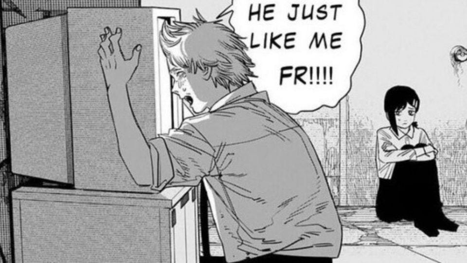

If you've been chatting with ChatGPT for the past few months, like me, you may have noticed that it got lazier and gloomier.

A few months ago, if you asked it to solve a coding puzzle, it'd give you the code in python—with all the details and comments you need to understand it. Now, it just says something like, "here's the code structure, just fill up the lines with '...' by yourself".

It's gotten annoying enough to the point OpenAI had to tweet that they didn't actually actively do anything to make ChatGPT output shorter responses. But then, why do people _feel_ ChatGPT has gotten lazier?

I clue lies in ChatGPT's "system prompt". The system prompt is a set of instructions, like "be kind and respectful", that OpenAI opaquely prepend to conversations with the AI to make it more human-friendly. The system prompt is mostly fixed… except for the current date.

So, researchers [tested whether the date in the system prompt would affect the length of ChatGPT's responses](https://twitter.com/RobLynch99/status/1734278713762549970). And indeed, it does! Strange!

---

I can think of two possible reasons why this happened, the first is rather mundane while the second verges on science fiction:

### 1. This might just be an unintended side-effect of OpenAI's pivot to mobile phones

ChatGPT's original UX was designed for bigger screens because the devs thought people would use it more as a work-companion than as a digital friend. But they were wrong. People actually use it more on their phones just to chat about random stuff—hence the pivot.

But the thing is: phones have smaller screens, so conversations on mobile are usually a lot shorter than on PCs. So, when OpenAI finetuned ChatGPT on similar conversations, the AI also learned to output shorter responses.

### 2. We may have infected ChatGPT with seasonal depression

Take this with a grain of salt, of course.

Being a bit lazier and sadder during the colder months is completely normal for us humans. We call this, "seasonal depression". It's often not an actual depression. It's just that the outside is too cold, so we cope up at home more and talk to our friends less. And without realizing it, this feeling bleeds into what we write and post on the internet.

Now, AIs like ChatGPT learn from all of the stuff accessible on the internet. So _maybe_, they may have noticed this pattern too and they're just emulating us. "Hey, humans are less active during the winter. Maybe it's time for me to wind down too..."

---

Of course, both reasons could be true at the same time. Who knows? Either way, it's very relatable.

---

Next time, I’ll talk about the emerging field of AI psychology. If you don’t want to miss it, please subscribe!

<iframe src="https://ponder.substack.com/embed" width="480" height="320" style="border:1px solid #EEE; background:white;" frameborder="0" scrolling="no"></iframe>

