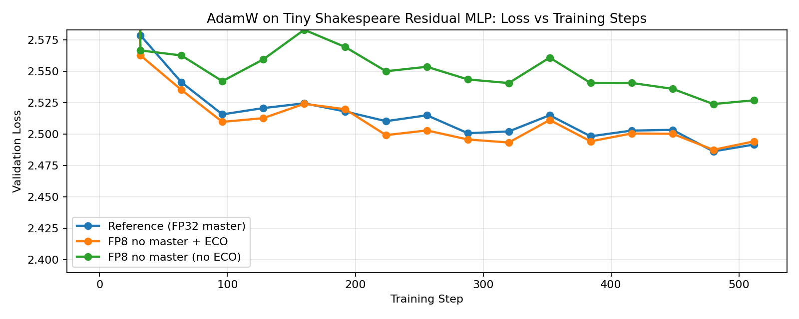
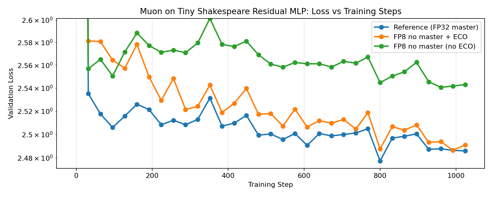

## 1. Introduction

To optimize inference in production settings, we typically need to quantize the model weights first, and then do all subsequent computation in low precision. But training in low precision natively is difficult, and so we often pretrain in high precision, quantize, then fine-tune to recover any lost performance. This wastes compute and we often do not fully recover the original performance.

Error-Compensating Optimizers (ECO), on the other hand, allows the (idealized) master weights to evolve in high precision while only materializing quantized weights ([Nikdan et al., 2026](https://arxiv.org/abs/2601.22101)). This eliminates the need for a separate quantization and fine-tuning phase. The crux is that we do not need to store both the weights and momentum buffers in full precision; it would suffice to store quantized weights and 'pull' the quantization 'error' back into the momentum buffer for use in the next step.

In this blog post, we shall discuss how to handle weight decay and matrix LMOs in the ECO framework.

## 2. ECO with weight decay

### 2.1. ECO for SGD with momentum and weight decay

Let $q(\cdot)$ be the quantization function, $W_t^*$ and $M_t^*$ be the (idealized) master weights and momentum, and $\widehat{W}_t$ and $M_t$ be the (materialized) quantized weights and (unquantized) momentum at step $t$. Then, the master-weight SGD update with momentum and weight decay is given by,
$$\begin{align}
    \widehat{W}_t &= q(W_t^*) \\
    G_t &= \nabla L(\widehat{W}_t) \\
    M_{t+1}^* &= \beta M_t^* + (1-\beta) G_t \label{eq:sgdm_m_update} \\
    W_{t+1}^* &= (1 - \eta \lambda) W_t^* - \eta M_{t+1}^* \label{eq:sgdm_w_update}
\end{align}$$
where $0 \leq \beta < 1, \eta > 0, \lambda \geq 0$ are the momentum, learning rate, and weight decay hyperparameters, respectively.

However, we do not want to materialize the master weights $W_t^*$, but only the quantized weights $\widehat{W}_t$, hence the ECO-style update of the form,
$$\begin{align}
    G_t
        &= \nabla L(\widehat{W}_t) \\
    \widetilde{M}_{t+1}
        &= \beta M_{t} + (1-\beta) G_t \label{eq:eco_sgdm_m_update} \\
    \widetilde{W}_{t+1}
        &= (1 - \eta \lambda) \widehat{W}_t - \eta \widetilde{M}_{t+1} \label{eq:eco_sgdm_w_update} \\
    \widehat{W}_{t+1}
        &= q(\widetilde{W}_{t+1}) \\
    E_{t+1}
        &= \widetilde{W}_{t+1} - \widehat{W}_{t+1} \label{eq:eco_sgdm_error} \\
    M_{t+1}
        &= \texttt{pullback}(\widetilde{M}_{t+1}, E_{t+1}),
\end{align}$$
where $\widetilde{M}_{t+1}$ and $\widetilde{W}_{t+1}$ are intermediate variables, and $\texttt{pullback}$ is the error-compensation function that 'pulls' the quantization 'error' back into the momentum buffer for use in the next step.

The challenge then is to find $\texttt{pullback}$ such that the intermediate weight variable $\widetilde{W}_t$ evolves the same as the (idealized) master weight $W_t^*$. That is, we want to enfore the invariant,
$$\begin{align}
    W_t^*
        &= \widetilde{W}_t,
\end{align}$$
for all $t \geq 0$.

To do this, let us first combine this constraint with Equations $\eqref{eq:sgdm_w_update}$, $\eqref{eq:eco_sgdm_w_update}$, and $\eqref{eq:eco_sgdm_error}$ as follows,
$$\begin{align}
    W_{t+1}^*
        &= \widetilde{W}_{t+1} \nonumber \\
    (1 - \eta \lambda) W_t^* - \eta M_{t+1}^*
        &= (1 - \eta \lambda) \widehat{W}_t - \eta \widetilde{M}_{t+1} \nonumber \\
    (1 - \eta \lambda) (\widehat{W}_t + E_t) - \eta M_{t+1}^*
        &= (1 - \eta \lambda) \widehat{W}_t - \eta \widetilde{M}_{t+1} \nonumber \\
    M_{t+1}^*
        &= \widetilde{M}_{t+1} + \frac{1 - \eta \lambda}{\eta} E_t. \label{eq:sgdm_m_update_expanded}
\end{align}$$

Now let $\alpha_t := M_t^* - M_t$. Then combining Equations $\eqref{eq:sgdm_m_update}$, $\eqref{eq:eco_sgdm_m_update}$, and $\eqref{eq:sgdm_m_update_expanded}$ yields,
$$\begin{align}
    \beta M_t^* + (1-\beta) G_t
        &= \widetilde{M}_{t+1} + \frac{1 - \eta \lambda}{\eta} E_t \nonumber \\
    \beta (M_t + \alpha_t) + (1-\beta) G_t
        &= \widetilde{M}_{t+1} + \frac{1 - \eta \lambda}{\eta} E_t \nonumber \\
    \cancel{\widetilde{M}_{t+1}} + \beta \alpha_t
        &= \cancel{\widetilde{M}_{t+1}} + \frac{1 - \eta \lambda}{\eta} E_t \nonumber \\
    \alpha_t
        &= \frac{1 - \eta \lambda}{\beta \eta} E_t
\end{align}$$
and since this holds for all $t$, we have,
$$\begin{align}
    \alpha_{t+1}
        &= \frac{1 - \eta \lambda}{\beta \eta} E_{t+1} \nonumber \\
    M_{t+1}
        &= M_{t+1}^* - \frac{1 - \eta \lambda}{\beta \eta} E_{t+1} \nonumber \\
        &= \widetilde{M}_{t+1} + \frac{1 - \eta \lambda}{\eta} E_t - \frac{1 - \eta \lambda}{\beta \eta} E_{t+1}
\end{align}$$

Lastly, we can eliminate the dependence on $E_t$ using the heuristic $E_t \approx E_{t+1}$ observed in practice, which gives us the error-compensating momentum update rule for SGD with momentum:
$$\begin{align}
    M_{t+1}
        &\approx \widetilde{M}_{t+1} + \frac{\color{red}{1 - \eta \lambda}}{\eta}\left(1 - \frac{1}{\beta}\right) E_{t+1} \label{eq:sgdm_error_compensation}
\end{align}$$
where the red-colored term is the difference from Algorithm 2 in the ECO paper.

### 2.2. ECO for steepest descent with LMOs of the form $\texttt{LMO}(X) = Xh(X)$

Steepest descent under a norm $\| \cdot \|$ with Linear Minimization Oracle (LMO), $\texttt{LMO}(X)$, has the following master-weight update rule:
$$\begin{align}
    \widehat{W}_t &= q(W_t^*) \\
    G_t &= \nabla L(\widehat{W}_t) \\
    M_{t+1}^* &= \beta M_t^* + (1-\beta) G_t \label{eq:sgdm_m_update_2} \\
    U_{t+1}^* &= \texttt{LMO}(M_{t+1}^*) \\
    W_{t+1}^* &= (1 - \eta \lambda) W_t^* - \eta U_{t+1}^* \label{eq:sgdm_w_update_2}
\end{align}$$
and as in the previous section, the ECO-style update is given by,
$$\begin{align}
    G_t
        &= \nabla L(\widehat{W}_t) \\
    \widetilde{M}_{t+1}
        &= \beta M_{t} + (1-\beta) G_t \label{eq:eco_sgdm_m_update_2} \\
    U_{t+1}
        &= \texttt{LMO}(\widetilde{M}_{t+1}) \label{eq:u_star_from_lmo} \\
    \widetilde{W}_{t+1}
        &= (1 - \eta \lambda) \widehat{W}_t - \eta U_{t+1} \label{eq:eco_sgdm_w_update_2} \\
    \widehat{W}_{t+1}
        &= q(\widetilde{W}_{t+1}) \\
    E_{t+1}
        &= \widetilde{W}_{t+1} - \widehat{W}_{t+1} \label{eq:eco_sgdm_error_2} \\
    M_{t+1}
        &= \texttt{pullback}(\widetilde{M}_{t+1}, E_{t+1}),
\end{align}$$

Enforcing $W_t^* = \widetilde{W}_t$ as before, we have,
$$\begin{align}
    W_{t+1}^*
        &= \widetilde{W}_{t+1} \nonumber \\
    (1 - \eta \lambda) W_t^* - \eta U_{t+1}^*
        &= (1 - \eta \lambda) \widehat{W}_t - \eta U_{t+1} \nonumber \\
    (1 - \eta \lambda) (\widehat{W}_t + E_t) - \eta U_{t+1}^*
        &= (1 - \eta \lambda) \widehat{W}_t - \eta U_{t+1} \nonumber \\
    U_{t+1}^*
        &= U_{t+1} + \frac{1 - \eta \lambda}{\eta} E_t. \label{eq:u_star_from_u}
\end{align}$$

For LMOs of the form $\texttt{LMO}(X) = X h(X)$ with invertible matrix-function $h: \mathbb{R}^{m \times n} \to \mathbb{R}^{m \times n}$, we then make the following approximation by freezing $h$ (valid for small perturbations $\Delta X$ or small learning rates $\eta$ which are common in practice):
$$\begin{align}
    \texttt{LMO}(X + \Delta X)
        &\approx \texttt{LMO}(X) + \Delta X h(X). \label{eq:lmo_approx}
\end{align}$$

Thus, combining Equations $\eqref{eq:u_star_from_lmo}$, $\eqref{eq:u_star_from_u}$, and $\eqref{eq:lmo_approx}$, we have,
$$\begin{align}
    U_{t+1}^*
        &= \texttt{LMO}(M_{t+1}^*) \nonumber \\
        &= \texttt{LMO}(\widetilde{M}_{t+1} + (M_{t+1}^* - \widetilde{M}_{t+1})) \nonumber \\
        &\approx U_{t+1} + (M_{t+1}^* - \widetilde{M}_{t+1}) h(\widetilde{M}_{t+1}) \nonumber \\
    \cancel{U_{t+1}} + \frac{1 - \eta \lambda}{\eta} E_t
        &\approx \cancel{U_{t+1}} + (M_{t+1}^* - \widetilde{M}_{t+1}) h(\widetilde{M}_{t+1}) \nonumber \\
    M_{t+1}^*
        &\approx \widetilde{M}_{t+1} + \frac{1 - \eta \lambda}{\eta} E_t h^{-1}(\widetilde{M}_{t+1}).
\end{align}$$

Following the same steps as before then yields,
$$\begin{align}
    M_{t+1}
        &\approx \widetilde{M}_{t+1} + \frac{\color{red}{1 - \eta \lambda}}{\eta}\left(1 - \frac{1}{\beta}\right) E_{t+1} \color{red}{h^{-1}(\widetilde{M}_{t+1})}.
\end{align}$$

#### 2.2.1. ECO-Muon

Specializing to steepest descent under the spectral norm (as in the Muon optimizer), we have the error-compensating momentum update rule for Muon:
$$\begin{align}
    \texttt{LMO}(X)
        &= \texttt{msign}(X) = X \underbrace{(X^T X)^{-1/2}}_{h(X)} \nonumber \\
    M_{t+1}
        &\approx \widetilde{M}_{t+1} + \frac{1 - \eta \lambda}{\eta}\left(1 - \frac{1}{\beta}\right) E_{t+1} (\widetilde{M}_{t+1}^T \widetilde{M}_{t+1})^{1/2},
\end{align}$$
which we can compute as in [Appendix A1](#appendix-a1-sample-implementation).

### 2.3. ECO for steepest descent with LMOs of the form $\texttt{LMO}(X) = X \odot h(X)$

Following the steps above for LMOs of the form $\texttt{LMO}(X) = X \odot h(X)$, where we apply the element-wise product $\odot$ between $X$ and $h(X)$, we instead have,
$$\begin{align}
    M_{t+1}^*
        &\approx \widetilde{M}_{t+1} + \frac{1 - \eta \lambda}{\eta} \frac{1}{h(\widetilde{M}_{t+1})} \odot E_t \\
    M_{t+1}
        &\approx \widetilde{M}_{t+1} + \frac{\color{red}{1 - \eta \lambda}}{\eta}\left(1 - \frac{1}{\beta}\right) {\color{red}{\frac{1}{h(\widetilde{M}_{t+1})} \odot}} E_{t+1}
\end{align}$$

#### 2.3.1. ECO-AdamW

And finally, for AdamW (Adam with (decoupled) weight decay), we have,
$$\begin{align}
    \texttt{LMO}(M_t)
        &= M_t \odot \frac{1 / (1 - \beta_1^t)}{\sqrt{V_t / (1 - \beta_2^t)} + \epsilon},
\end{align}$$
where $V_t$ is the second moment accumulator. Thus,
$$\begin{align}
    M_{t+1}
        &\approx \widetilde{M}_{t+1} + \frac{{\color{blue}{(1 - \eta \lambda)}}(1 - \beta_1^{t+1})}{\eta} \left( 1 - \frac{1}{\beta_1} \right) \left( \sqrt{\frac{V_{t+1}}{1 - \beta_2^{t+1}}} + \epsilon \right) \odot E_{t+1},
\end{align}$$
where the blue-colored term is the difference from Algorithm 3 in the ECO paper.

## 3. Experiments [WIP]

Here we train 4-layer Residual MLPs on the Tiny Shakespeare dataset with FP8 ECO-AdamW and ECO-Muon, and compare with their (still FP8) non-ECO counterparts and a reference full-precision implemention. For the FP8 training runs, we quantize both the weights and activations with a straight-through estimator in the forward pass of the linear layers. Language model heads are kept in full-precision for all runs since it is the most sensitive to quantization. And Embedding layers are always optimized either by ECO-AdamW or its non-ECO counterpart since Muon is only designed for linear layers.

> Important note: these are preliminary results, and I haven't fully tuned the hyperparameters for these runs yet.

### 3.1. ECO-AdamW



### 3.2. ECO-Muon



### 3.3. Discussion

Our results show that ECO-AdamW and ECO-Muon closely track their full-precision counterparts, while the non-ECO versions noticeably diverge, demonstrating the effectiveness of ECO in FP8-native training without master weights. When FP8 training is enabled for all components (including the language model head), we see even more significant divergence for the non-ECO versions, while the ECO versions see only a slight increase in loss, matching the results by [Nikdan et al., 2026](https://arxiv.org/abs/2601.22101).

## How to cite

```bibtex
@misc{cesista2026eco,
  author = {Franz Louis Cesista},
  title = {{E}rror-{C}ompensating {O}ptimizers: {ECO}-{A}dam{W}, {ECO}-{M}uon, and Beyond},
  year = {2026},
  month = {February},
  day = {10},
  url = {https://leloykun.github.io/ponder/eco/},
}
```


## References

1. Mahdi Nikdan, Amir Zandieh, Dan Alistarh, Vahab Mirrokni (2026). ECO: Quantized Training without Full-Precision Master Weights. URL https://arxiv.org/abs/2601.22101
2. Thomas Pethick, Wanyun Xie, Kimon Antonakopoulos, Zhenyu Zhu, Antonio Silveti-Falls, Volkan Cevher (2025). Training Deep Learning Models with Norm-Constrained LMOs. URL https://arxiv.org/abs/2502.07529

## Appendix A1. Sample implementation

```python
# Newton-Schulz coefficients for matrix square roots
COEFS_R2: List[Tuple[float, float, float]] = [
    (8.287212018145622, -23.59588651909882, 17.300387312530923),
    (4.107059111542197, -2.9478499167379084, 0.54484310829266),
    (3.9486908534822938, -2.908902115962947, 0.5518191394370131),
    (3.3184196573706055, -2.488488024314878, 0.5100489401237208),
    (2.3006520199548186, -1.6689039845747518, 0.4188073119525678),
    (1.8913014077874002, -1.2679958271945908, 0.37680408948524996),
    (1.875, -1.25, 0.375),
]

# Muon orthogonalization coefficients.
MUON_NS_COEFFS: List[Tuple[float, float, float]] = [
    (7.2086, -15.5131, 9.0178),
    (3.9623, -2.5813, 0.4542),
    (3.9466, -2.5765, 0.4544),
    (3.8991, -2.5671, 0.4566),
    (3.7186, -2.5308, 0.4653),
    (3.1390, -2.3073, 0.4733),
    (2.1715, -1.5246, 0.3885),
    (1.8648, -1.2224, 0.3577),
]

def _abc(coefs, step: int, scale: float) -> Tuple[float, float, float]:
    a, b, c = coefs[step] if step < len(coefs) else coefs[-1]
    # For r=2: (a/scale, b/scale^3, c/scale^5).
    return a / scale, b / (scale**3), c / (scale**5)

def _orthogonalize(M: torch.Tensor, *, steps: int = 8, eps: float = 1e-6, scale: float = 1.) -> torch.Tensor:
    # Computes msign(M) = M (M^T M)^{-1/2} = UV^T
    transpose = M.shape[0] > M.shape[1]
    if transpose:
        M = M.mT
    norm = torch.linalg.norm(M, dim=(-2, -1), keepdim=True)
    M = M / (norm + eps)
    for k in range(steps)
        a, b, c = _abc(MUON_NS_COEFFS, k, scale)
        M = a * M + (b * (U := M @ M.mT) + c * (U @ U)) @ M
    if transpose:
        M = M.mT
    return M

def _matrix_sqrt(P: torch.Tensor, *, steps: int = 8, eps: float = 1e-6, scale: float = 1.01) -> torch.Tensor:
    # Computes P^{1/2}
    assert P.ndim == 2 and P.shape[0] == P.shape[1], "P must be square"
    norm = torch.linalg.norm(P, dim=(-2, -1), keepdim=True)
    if norm <= eps:
        return torch.zeros_like(P)
    Y = YZ = P / norm
    I_n = torch.eye(P.shape[0], device=P.device, dtype=P.dtype)
    for k in range(steps):
        a, b, c = _abc(COEFS_R2, k, scale)
        W = a * I_n + b * YZ + c * (YZ @ YZ)
        Y, YZ = W @ Y, (W @ W) @ YZ
    return Y * norm**0.5

def quantize(W: torch.Tensor) -> torch.Tensor:
    ...

def update(G: torch.Tensor, M: torch.Tensor, W_quantized: torch.Tensor, eta: float, beta=0.9, lamb=0.1) -> torch.Tensor:
    M_tilde = beta * M + (1 - beta) * G
    W_tilde = (1 - eta * lamb) * W_quantized.to(M_tilde.dtype) - eta * _orthogonalize(M_tilde)
    W_quantized_next = quantize(W_tilde)
    E = W_tilde - W_quantized_next
    # Pullback weight quantization error to momentum buffer for use in the next step.
    M_next = M_tilde + (1 - eta * lamb) / eta * (1 - 1 / beta) * E @ _matrix_sqrt(M_tilde.T @ M_tilde)
    return M_next, W_quantized_next
```
