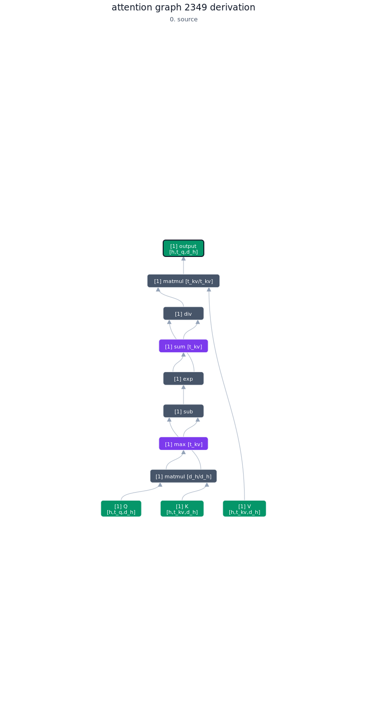
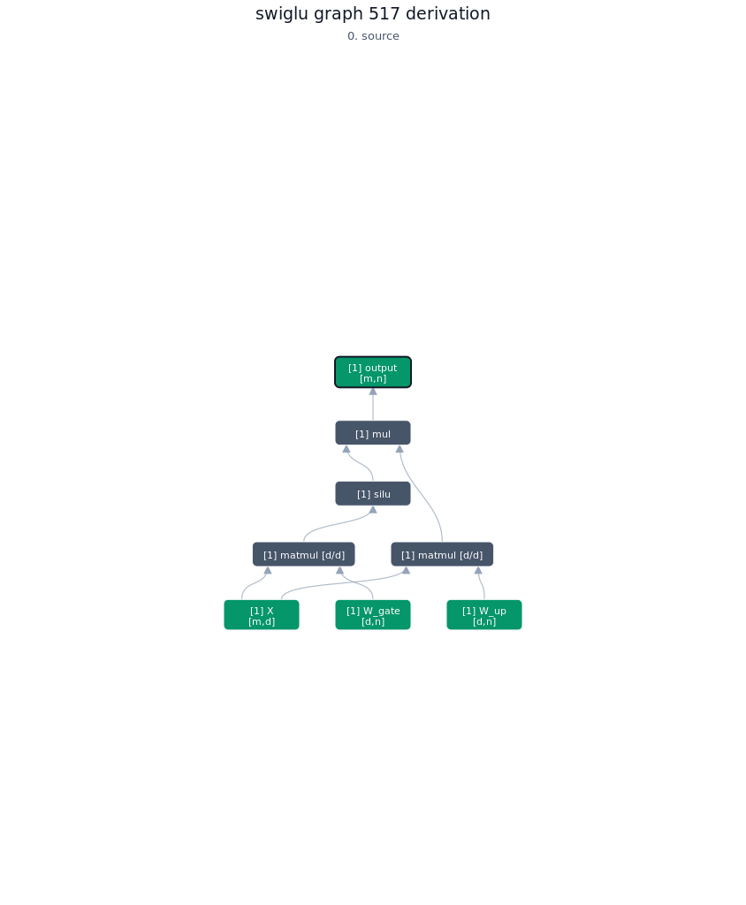
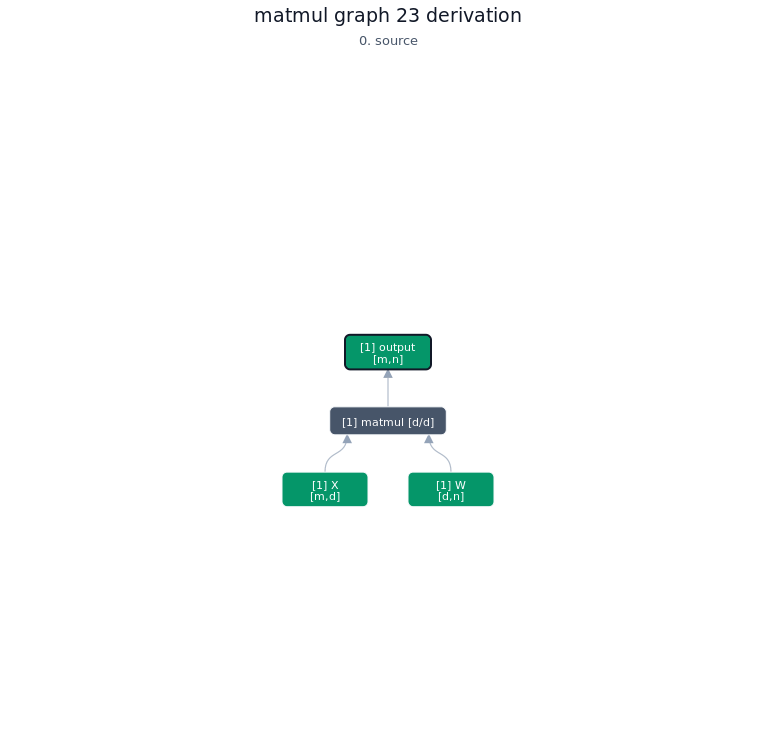
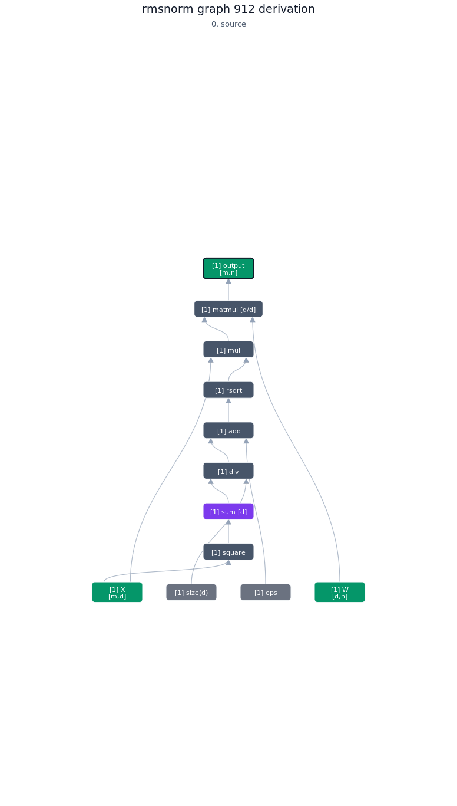
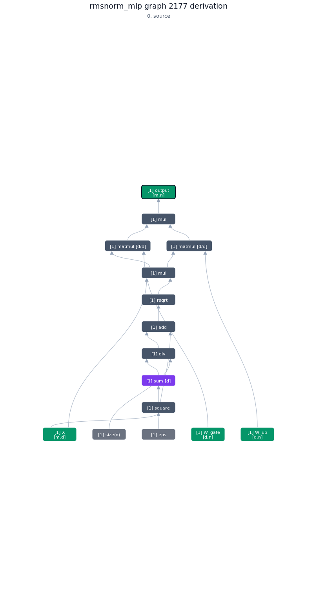

## 1. Overview

I'm bearish on "autoresearch" methods on AI research that merely do code fuzzing. And they typically optimize the wrong thing: good performance at small scales rarely ever transfers to good performance at larger scales (e.g., removing weight decay). Instead, we should be more bitter-lesson-pilled and compare scaling laws.

But when doing architecture search, comparing scaling laws can only be fair if, at the very least, we also optimize the GPU/TPU kernels, optimizer choices, hyperparameters and such and figure out how to adjust them as we scale up. This is the expensive and time-consuming part, and currently we have to do this for each new architecture! Some kernels are also more stable (and sometimes even faster) when the weights and activations satisfy certain constraints which we oftentimes can enforce via optimizer choices and parametrization. As such, ideally, all these things should be optimized jointly.

With this project, I now have the formal infrastructure where I (or my agents) can define neural network architectures in Lean4, and then automatically get:
1. Optimized IO-aware accelerator kernels.
2. Optimizer choices and parametrization that enable hyperparameter transfer across width and depth. For more details, see [my previous blog posts](https://leloykun.github.io/ponder/).
3. Hyperparameter scaling laws that tell us how to adjust hyperparameters as we scale batch size, training horizon, dataset size, etc. For more details, see [steepest-descent-lean](https://github.com/leloykun/steepest-descent-lean).
4. Low-rank proxies for the optimizers to speed up hyperparameter tuning at small scales and have them transfer to the full-rank case (we have an upcoming paper on this, stay tuned).

## 2. Results

| Workload    | Case                     | TileLang (ms) | torch.compile (ms) | Speedup | Equivalent to prior work? |
| ----------- | ------------------------ | -------: | ------------: | ------: | ----------: |
| attention   | h16_tq4096_tkv4096_dh128 | 0.531712 |      2.168960 |  4.079x | [Flash Attention 2](https://arxiv.org/abs/2307.08691) |
| swiglu      | m1024_n2048_d2048        | 0.056797 |      0.121536 |  2.140x |  |
| matmul      | m1024_d4096_n4096        | 0.125324 |      0.162112 |  1.294x |  |
| rmsnorm     | m1024_n4096_d4096        | 0.206554 |      0.174016 |  0.842x | [FlashNorm](https://arxiv.org/abs/2407.09577) |
| rmsnorm_mlp | m1024_n1024_d1024        | 0.037851 |      0.072384 |  1.912x | - |

## 3. Top-1 Kernel per Workload

### 3.1. Attention

#### 3.1.1. Lean4 source

```lean
def softmaxSubdag (scores : NodeId) (axis : Axis) : DagM NodeId := do
  let weights ← exp scores
  let denom ← red .sum weights axis
  div weights denom

def attentionGraph : Graph :=
  buildGraphWithOutput "attention" do
    let q ← input "Q" shapeHTqDh
    let k ← input "K" shapeHTkvDh
    let v ← input "V" shapeHTkvDh
    let scores ← matmul q k "d_h" "d_h"
    let probs ← softmaxSubdag scores "t_kv"
    let out ← matmul probs v "t_kv" "t_kv"
    output out
```

#### 3.1.2. Derivation of top-1 kernel

<div align="center">
    
</div>

#### 3.1.3. TileLang code of top-1 kernel

```python
def build_kernel(
    d_h: int = 128,
    h: int = 16,
    t_kv: int = 4096,
    t_q: int = 4096,
    block_t_kv: int = 128,
    block_t_q: int = 128,
    threads: int = 256,
    num_stages: int = 2,
    enable_swizzle: bool = True,
    enable_autotune: bool = False,
    autotune_warmup: int = 10,
    autotune_rep: int = 10,
    autotune_timeout: int = 100,
):
    dtype = T.float16
    accum_dtype = T.float32
    scale = 1.44269504  # log2(e)
    fast_math_pass_configs = {tilelang.PassConfigKey.TL_ENABLE_FAST_MATH: True}
    jit_decorator = tilelang.jit(out_idx=[-1], pass_configs=fast_math_pass_configs)
    if enable_autotune:
        def decorate(fn):
            return tilelang.autotune(configs=get_configs(), warmup=autotune_warmup, rep=autotune_rep, timeout=autotune_timeout, skip_check=True)(jit_decorator(fn))
    else:
        def decorate(fn):
            return jit_decorator(fn)

    @decorate
    def attention_c2349_jit(d_h: int = d_h, h: int = h, t_kv: int = t_kv, t_q: int = t_q, block_t_kv: int = block_t_kv, block_t_q: int = block_t_q, threads: int = threads, num_stages: int = num_stages, enable_swizzle: bool = enable_swizzle):
        @T.prim_func
        def main(
            Q: T.Tensor((h, t_q, d_h), dtype),
            K: T.Tensor((h, t_kv, d_h), dtype),
            V: T.Tensor((h, t_kv, d_h), dtype),
            O: T.Tensor((h, t_q, d_h), dtype),
        ):
            with T.Kernel(T.ceildiv(t_q, block_t_q), h, threads=threads) as (gx, gy):
                input_0 = T.alloc_shared((block_t_q, d_h), dtype)
                input_4 = T.alloc_shared((block_t_kv, d_h), dtype)
                matmul_8 = T.alloc_fragment((block_t_q, block_t_kv), accum_dtype)
                red_max_9 = T.alloc_fragment((block_t_q,), accum_dtype)
                input_15 = T.alloc_shared((block_t_kv, d_h), dtype)
                matmul_19 = T.alloc_fragment((block_t_q, d_h), accum_dtype)
                state_pass0_o = T.alloc_fragment((block_t_q, d_h), accum_dtype)
                red_sum_22 = T.alloc_fragment((block_t_q,), accum_dtype)
                state_pass0_l = T.alloc_fragment((block_t_q,), accum_dtype)
                state_pass0_m = T.alloc_fragment((block_t_q,), accum_dtype)
                scale_old_state_pass0_m = T.alloc_fragment((block_t_q,), accum_dtype)
                scale_tile_state_pass0_m = T.alloc_fragment((block_t_q,), accum_dtype)
                cast_lhs_19 = T.alloc_fragment((block_t_q, block_t_kv), dtype)
                T.annotate_layout({
                    input_0: make_swizzle_layout(input_0),
                    input_4: make_swizzle_layout(input_4),
                    input_15: make_swizzle_layout(input_15),
                })
                T.use_swizzle(panel_size=10, enable=enable_swizzle)
                T.fill(state_pass0_m, -T.infinity(accum_dtype))
                T.clear(state_pass0_l)
                T.clear(state_pass0_o)
                T.copy(Q[gy, gx * block_t_q, 0], input_0)
                for k_pass0 in T.Pipelined(T.ceildiv(t_kv, block_t_kv), num_stages=num_stages):
                    T.copy(K[gy, k_pass0 * block_t_kv, 0], input_4)
                    T.gemm(input_0, input_4, matmul_8, clear_accum=True, transpose_B=True, policy=T.GemmWarpPolicy.FullRow)
                    T.reduce_max(matmul_8, red_max_9, dim=1, clear=True)
                    for i0, i1 in T.Parallel(block_t_q, block_t_kv):
                        matmul_8[i0, i1] = matmul_8[i0, i1] - red_max_9[i0]
                        matmul_8[i0, i1] = T.exp2((matmul_8[i0, i1]) * scale)
                    T.reduce_sum(matmul_8, red_sum_22, dim=1, clear=True)
                    T.copy(V[gy, k_pass0 * block_t_kv, 0], input_15)
                    T.copy(matmul_8, cast_lhs_19)
                    T.gemm(cast_lhs_19, input_15, matmul_19, clear_accum=True, policy=T.GemmWarpPolicy.FullRow)
                    for i0 in T.Parallel(block_t_q):
                        scale_old_state_pass0_m[i0] = state_pass0_m[i0]
                        state_pass0_m[i0] = T.max(scale_old_state_pass0_m[i0], red_max_9[i0])
                        scale_old_state_pass0_m[i0] = T.exp2((scale_old_state_pass0_m[i0] - state_pass0_m[i0]) * scale)
                        scale_tile_state_pass0_m[i0] = T.exp2((red_max_9[i0] - state_pass0_m[i0]) * scale)
                        state_pass0_l[i0] = state_pass0_l[i0] * scale_old_state_pass0_m[i0] + red_sum_22[i0] * scale_tile_state_pass0_m[i0]
                    for i0, i1 in T.Parallel(block_t_q, d_h):
                        state_pass0_o[i0, i1] = state_pass0_o[i0, i1] * scale_old_state_pass0_m[i0] + matmul_19[i0, i1] * scale_tile_state_pass0_m[i0]
                for i0, i1 in T.Parallel(block_t_q, d_h):
                    state_pass0_o[i0, i1] = state_pass0_o[i0, i1] / state_pass0_l[i0]
                T.copy(state_pass0_o, O[gy, gx * block_t_q, 0])
        return main

    return attention_c2349_jit()
```

### 3.2. SwiGLU

#### 3.2.1. Lean4 source

```lean
def swigluGraph : Graph :=
  buildGraphWithOutput "swiglu" do
    let x ← input "X" shapeMD
    let wUp ← input "W_up" shapeDN
    let wGate ← input "W_gate" shapeDN
    let gatePre ← matmul x wGate "d" "d"
    let up ← matmul x wUp "d" "d"
    let gate ← silu gatePre
    let out ← mul gate up
    output out
```

#### 3.2.2. Derivation of top-1 kernel

<div align="center">
    
</div>

#### 3.2.3. TileLang of top-1 kernel

```python
def build_kernel(
    d: int = 2048,
    m: int = 1024,
    n: int = 2048,
    block_d: int = 128,
    block_m: int = 128,
    block_n: int = 128,
    threads: int = 256,
    num_stages: int = 2,
    enable_swizzle: bool = True,
    enable_autotune: bool = False,
    autotune_warmup: int = 10,
    autotune_rep: int = 10,
    autotune_timeout: int = 100,
):
    dtype = T.float16
    accum_dtype = T.float32
    scale = 1.44269504  # log2(e)
    fast_math_pass_configs = {tilelang.PassConfigKey.TL_ENABLE_FAST_MATH: True}
    jit_decorator = tilelang.jit(out_idx=[-1], pass_configs=fast_math_pass_configs)
    if enable_autotune:
        def decorate(fn):
            return tilelang.autotune(configs=get_configs(), warmup=autotune_warmup, rep=autotune_rep, timeout=autotune_timeout, skip_check=True)(jit_decorator(fn))
    else:
        def decorate(fn):
            return jit_decorator(fn)

    @decorate
    def swiglu_c517_jit(d: int = d, m: int = m, n: int = n, block_d: int = block_d, block_m: int = block_m, block_n: int = block_n, threads: int = threads, num_stages: int = num_stages, enable_swizzle: bool = enable_swizzle):
        @T.prim_func
        def main(
            X: T.Tensor((m, d), dtype),
            W_up: T.Tensor((d, n), dtype),
            W_gate: T.Tensor((d, n), dtype),
            O: T.Tensor((m, n), dtype),
        ):
            with T.Kernel(T.ceildiv(n, block_n), T.ceildiv(m, block_m), threads=threads) as (gx, gy):
                input_0 = T.alloc_shared((block_m, block_d), dtype)
                input_4 = T.alloc_shared((block_d, block_n), dtype)
                matmul_8 = T.alloc_fragment((block_m, block_n), accum_dtype)
                input_10 = T.alloc_shared((block_d, block_n), dtype)
                matmul_14 = T.alloc_fragment((block_m, block_n), accum_dtype)
                T.annotate_layout({
                    input_0: make_swizzle_layout(input_0),
                    input_4: make_swizzle_layout(input_4),
                    input_10: make_swizzle_layout(input_10),
                })
                T.use_swizzle(panel_size=10, enable=enable_swizzle)
                T.clear(matmul_8)
                T.clear(matmul_14)
                for k_pass0 in T.Pipelined(T.ceildiv(d, block_d), num_stages=num_stages):
                    T.copy(X[gy * block_m, k_pass0 * block_d], input_0)
                    T.copy(W_up[k_pass0 * block_d, gx * block_n], input_4)
                    T.gemm(input_0, input_4, matmul_8, clear_accum=False)
                    T.copy(W_gate[k_pass0 * block_d, gx * block_n], input_10)
                    T.gemm(input_0, input_10, matmul_14, clear_accum=False)
                for i0, i1 in T.Parallel(block_m, block_n):
                    matmul_14[i0, i1] = matmul_14[i0, i1] / (1.0 + T.exp2((-(matmul_14[i0, i1])) * scale))
                    matmul_14[i0, i1] = matmul_8[i0, i1] * matmul_14[i0, i1]
                T.copy(matmul_14, O[gy * block_m, gx * block_n])
        return main

    return swiglu_c517_jit()
```

### 3.3. Matmul

#### 3.3.1. Lean4 source

```lean
def matmulGraph : Graph :=
  buildGraphWithOutput "matmul" do
    let x ← input "X" shapeMD
    let w ← input "W" shapeDN
    let out ← matmul x w "d" "d"
    output out
```

#### 3.3.2. Derivation of top-1 kernel

<div align="center">
    
</div>

#### 3.3.3. TileLang of top-1 kernel

```python
def build_kernel(
    d: int = 4096,
    m: int = 1024,
    n: int = 4096,
    block_d: int = 128,
    block_m: int = 128,
    block_n: int = 128,
    threads: int = 256,
    num_stages: int = 2,
    enable_swizzle: bool = True,
    enable_autotune: bool = False,
    autotune_warmup: int = 10,
    autotune_rep: int = 10,
    autotune_timeout: int = 100,
):
    dtype = T.float16
    accum_dtype = T.float32
    scale = 1.44269504  # log2(e)
    fast_math_pass_configs = {tilelang.PassConfigKey.TL_ENABLE_FAST_MATH: True}
    jit_decorator = tilelang.jit(out_idx=[-1], pass_configs=fast_math_pass_configs)
    if enable_autotune:
        def decorate(fn):
            return tilelang.autotune(configs=get_configs(), warmup=autotune_warmup, rep=autotune_rep, timeout=autotune_timeout, skip_check=True)(jit_decorator(fn))
    else:
        def decorate(fn):
            return jit_decorator(fn)

    @decorate
    def matmul_c23_jit(d: int = d, m: int = m, n: int = n, block_d: int = block_d, block_m: int = block_m, block_n: int = block_n, threads: int = threads, num_stages: int = num_stages, enable_swizzle: bool = enable_swizzle):
        @T.prim_func
        def main(
            X: T.Tensor((m, d), dtype),
            W: T.Tensor((d, n), dtype),
            O: T.Tensor((m, n), dtype),
        ):
            with T.Kernel(T.ceildiv(n, block_n), T.ceildiv(m, block_m), threads=threads) as (gx, gy):
                input_0 = T.alloc_shared((block_m, block_d), dtype)
                input_4 = T.alloc_shared((block_d, block_n), dtype)
                matmul_8 = T.alloc_fragment((block_m, block_n), accum_dtype)
                T.annotate_layout({
                    input_0: make_swizzle_layout(input_0),
                    input_4: make_swizzle_layout(input_4),
                })
                T.use_swizzle(panel_size=10, enable=enable_swizzle)
                T.clear(matmul_8)
                for k_pass0 in T.Pipelined(T.ceildiv(d, block_d), num_stages=num_stages):
                    T.copy(X[gy * block_m, k_pass0 * block_d], input_0)
                    T.copy(W[k_pass0 * block_d, gx * block_n], input_4)
                    T.gemm(input_0, input_4, matmul_8, clear_accum=False)
                T.copy(matmul_8, O[gy * block_m, gx * block_n])
        return main

    return matmul_c23_jit()
```

### 3.4. RMSNorm

#### 3.4.1. Lean4 source

```lean
def meanAlongSubdag (x : NodeId) (axis : Axis) : DagM NodeId := do
  let s ← red .sum x axis
  let n ← sizeConst axis
  div s n

def rmsNormSubdag (x : NodeId) (axis : Axis) : DagM NodeId := do
  let x2 ← square x
  let mean ← meanAlongSubdag x2 axis
  let eps ← epsConst
  let denom ← add mean eps
  let scale ← rsqrt denom
  mul x scale

def rmsnormGraph : Graph :=
  buildGraphWithOutput "rmsnorm" do
    let x ← input "X" shapeMD
    let w ← input "W" shapeDN
    let norm ← rmsNormSubdag x "d"
    let out ← matmul norm w "d" "d"
    output out
```

#### 3.4.2. Derivation of top-1 kernel

<div align="center">
    
</div>

#### 3.4.3. TileLang of top-1 kernel

```python
def build_kernel(
    d: int = 4096,
    m: int = 1024,
    n: int = 4096,
    block_d: int = 128,
    block_m: int = 128,
    block_n: int = 128,
    threads: int = 256,
    num_stages: int = 2,
    enable_swizzle: bool = True,
    enable_autotune: bool = False,
    autotune_warmup: int = 10,
    autotune_rep: int = 10,
    autotune_timeout: int = 100,
):
    dtype = T.float16
    accum_dtype = T.float32
    scale = 1.44269504  # log2(e)
    fast_math_pass_configs = {tilelang.PassConfigKey.TL_ENABLE_FAST_MATH: True}
    scale_jit_decorator = tilelang.jit(out_idx=[2], pass_configs=fast_math_pass_configs)
    compute_jit_decorator = tilelang.jit(out_idx=[3], pass_configs=fast_math_pass_configs)
    if enable_autotune:
        def decorate_scale(fn):
            return tilelang.autotune(configs=get_configs(), warmup=autotune_warmup, rep=autotune_rep, timeout=autotune_timeout, skip_check=True)(scale_jit_decorator(fn))
        def decorate_compute(fn):
            return tilelang.autotune(configs=get_configs(), warmup=autotune_warmup, rep=autotune_rep, timeout=autotune_timeout, skip_check=True)(compute_jit_decorator(fn))
    else:
        def decorate_scale(fn):
            return scale_jit_decorator(fn)
        def decorate_compute(fn):
            return compute_jit_decorator(fn)

    @decorate_scale
    def rmsnorm_c912_scale_jit(d: int = d, m: int = m, n: int = n, block_d: int = block_d, block_m: int = block_m, block_n: int = block_n, threads: int = threads, num_stages: int = num_stages, enable_swizzle: bool = enable_swizzle):
        @T.prim_func
        def scale_main(
            X: T.Tensor((m, d), dtype),
            eps: T.float32,
            S: T.Tensor((m,), accum_dtype),
        ):
            with T.Kernel(T.ceildiv(m, block_m), threads=threads) as gy:
                X_tile = T.alloc_shared((block_m, block_d), dtype)
                X_pow = T.alloc_fragment((block_m, block_d), accum_dtype)
                row_state = T.alloc_fragment((block_m,), accum_dtype)
                T.clear(X_pow)
                for k_stream in T.Pipelined(T.ceildiv(d, block_d), num_stages=num_stages):
                    T.copy(X[gy * block_m, k_stream * block_d], X_tile)
                    for i0, i1 in T.Parallel(block_m, block_d):
                        X_pow[i0, i1] = X_pow[i0, i1] + X_tile[i0, i1] * X_tile[i0, i1]
                T.reduce_sum(X_pow, row_state, dim=1)
                for i0 in T.Parallel(block_m):
                    S[gy * block_m + i0] = 1.0 / T.sqrt(row_state[i0] / d + eps)
        return scale_main

    @decorate_compute
    def rmsnorm_c912_compute_jit(d: int = d, m: int = m, n: int = n, block_d: int = block_d, block_m: int = block_m, block_n: int = block_n, threads: int = threads, num_stages: int = num_stages, enable_swizzle: bool = enable_swizzle):
        @T.prim_func
        def compute_main(
            X: T.Tensor((m, d), dtype),
            W: T.Tensor((d, n), dtype),
            S: T.Tensor((m,), accum_dtype),
            O: T.Tensor((m, n), dtype),
        ):
            with T.Kernel(T.ceildiv(n, block_n), T.ceildiv(m, block_m), threads=threads) as (gx, gy):
                X_tile = T.alloc_shared((block_m, block_d), dtype)
                W_tile = T.alloc_shared((block_d, block_n), dtype)
                acc_0 = T.alloc_fragment((block_m, block_n), accum_dtype)
                T.use_swizzle(panel_size=10, enable=enable_swizzle)
                T.clear(acc_0)
                for k_stream in T.Pipelined(T.ceildiv(d, block_d), num_stages=num_stages):
                    T.copy(X[gy * block_m, k_stream * block_d], X_tile)
                    T.copy(W[k_stream * block_d, gx * block_n], W_tile)
                    T.gemm(X_tile, W_tile, acc_0, clear_accum=False)
                for i0, i1 in T.Parallel(block_m, block_n):
                    acc_0[i0, i1] = acc_0[i0, i1] * S[gy * block_m + i0]
                T.copy(acc_0, O[gy * block_m, gx * block_n])
        return compute_main

    scale_kernel = rmsnorm_c912_scale_jit()
    compute_kernel = rmsnorm_c912_compute_jit()
    input_names = ['X', 'W']
    def materialized_kernel(*args):
        input_count = len(input_names)
        values = dict(zip(input_names, args[:input_count]))
        eps_value = args[input_count] if len(args) > input_count else 1.0e-5
        S = scale_kernel(values['X'], eps_value)
        return compute_kernel(values['X'], values['W'], S)
    def get_kernel_source():
        parts = []
        for kernel in (scale_kernel, compute_kernel):
            if hasattr(kernel, 'get_kernel_source'):
                parts.append(str(kernel.get_kernel_source()))
        return '\n\n'.join(parts)
    materialized_kernel.get_kernel_source = get_kernel_source
    return materialized_kernel
```

### 3.5. RMSNorm-MLP

#### 3.5.1. Lean4 source

```lean
def rmsnormMlpGraph : Graph :=
  buildGraphWithOutput "rmsnorm_mlp" do
    let x ← input "X" shapeMD
    let wUp ← input "W_up" shapeDN
    let wGate ← input "W_gate" shapeDN
    let norm ← rmsNormSubdag x "d"
    let up ← matmul norm wUp "d" "d"
    let gate ← matmul norm wGate "d" "d"
    let out ← mul up gate
    output out
```

#### 3.5.2. Derivation of top-1 kernel

<div align="center">
    
</div>

#### 3.5.3. TileLang of top-1 kernel

```python
def build_kernel(
    d: int = 1024,
    m: int = 1024,
    n: int = 1024,
    block_d: int = 64,
    block_m: int = 128,
    block_n: int = 128,
    threads: int = 256,
    num_stages: int = 2,
    enable_swizzle: bool = True,
    enable_autotune: bool = False,
    autotune_warmup: int = 10,
    autotune_rep: int = 10,
    autotune_timeout: int = 100,
):
    dtype = T.float16
    accum_dtype = T.float32
    scale = 1.44269504  # log2(e)
    fast_math_pass_configs = {tilelang.PassConfigKey.TL_ENABLE_FAST_MATH: True}
    scale_jit_decorator = tilelang.jit(out_idx=[2], pass_configs=fast_math_pass_configs)
    compute_jit_decorator = tilelang.jit(out_idx=[4], pass_configs=fast_math_pass_configs)
    if enable_autotune:
        def decorate_scale(fn):
            return tilelang.autotune(configs=get_configs(), warmup=autotune_warmup, rep=autotune_rep, timeout=autotune_timeout, skip_check=True)(scale_jit_decorator(fn))
        def decorate_compute(fn):
            return tilelang.autotune(configs=get_configs(), warmup=autotune_warmup, rep=autotune_rep, timeout=autotune_timeout, skip_check=True)(compute_jit_decorator(fn))
    else:
        def decorate_scale(fn):
            return scale_jit_decorator(fn)
        def decorate_compute(fn):
            return compute_jit_decorator(fn)

    @decorate_scale
    def rmsnorm_mlp_c2177_scale_jit(d: int = d, m: int = m, n: int = n, block_d: int = block_d, block_m: int = block_m, block_n: int = block_n, threads: int = threads, num_stages: int = num_stages, enable_swizzle: bool = enable_swizzle):
        @T.prim_func
        def scale_main(
            X: T.Tensor((m, d), dtype),
            eps: T.float32,
            S: T.Tensor((m,), accum_dtype),
        ):
            with T.Kernel(T.ceildiv(m, block_m), threads=threads) as gy:
                X_tile = T.alloc_shared((block_m, block_d), dtype)
                X_pow = T.alloc_fragment((block_m, block_d), accum_dtype)
                row_state = T.alloc_fragment((block_m,), accum_dtype)
                T.clear(X_pow)
                for k_stream in T.Pipelined(T.ceildiv(d, block_d), num_stages=num_stages):
                    T.copy(X[gy * block_m, k_stream * block_d], X_tile)
                    for i0, i1 in T.Parallel(block_m, block_d):
                        X_pow[i0, i1] = X_pow[i0, i1] + X_tile[i0, i1] * X_tile[i0, i1]
                T.reduce_sum(X_pow, row_state, dim=1)
                for i0 in T.Parallel(block_m):
                    S[gy * block_m + i0] = 1.0 / T.sqrt(row_state[i0] / d + eps)
        return scale_main

    @decorate_compute
    def rmsnorm_mlp_c2177_compute_jit(d: int = d, m: int = m, n: int = n, block_d: int = block_d, block_m: int = block_m, block_n: int = block_n, threads: int = threads, num_stages: int = num_stages, enable_swizzle: bool = enable_swizzle):
        @T.prim_func
        def compute_main(
            X: T.Tensor((m, d), dtype),
            W_gate: T.Tensor((d, n), dtype),
            W_up: T.Tensor((d, n), dtype),
            S: T.Tensor((m,), accum_dtype),
            O: T.Tensor((m, n), dtype),
        ):
            with T.Kernel(T.ceildiv(n, block_n), T.ceildiv(m, block_m), threads=threads) as (gx, gy):
                X_tile = T.alloc_shared((block_m, block_d), dtype)
                W_gate_tile = T.alloc_shared((block_d, block_n), dtype)
                acc_0 = T.alloc_fragment((block_m, block_n), accum_dtype)
                W_up_tile = T.alloc_shared((block_d, block_n), dtype)
                acc_1 = T.alloc_fragment((block_m, block_n), accum_dtype)
                T.use_swizzle(panel_size=10, enable=enable_swizzle)
                T.clear(acc_0)
                T.clear(acc_1)
                for k_stream in T.Pipelined(T.ceildiv(d, block_d), num_stages=num_stages):
                    T.copy(X[gy * block_m, k_stream * block_d], X_tile)
                    T.copy(W_gate[k_stream * block_d, gx * block_n], W_gate_tile)
                    T.gemm(X_tile, W_gate_tile, acc_0, clear_accum=False)
                    T.copy(W_up[k_stream * block_d, gx * block_n], W_up_tile)
                    T.gemm(X_tile, W_up_tile, acc_1, clear_accum=False)
                for i0, i1 in T.Parallel(block_m, block_n):
                    acc_0[i0, i1] = acc_0[i0, i1] * S[gy * block_m + i0]
                    acc_1[i0, i1] = acc_1[i0, i1] * S[gy * block_m + i0]
                    acc_0[i0, i1] = acc_0[i0, i1] * acc_1[i0, i1]
                T.copy(acc_0, O[gy * block_m, gx * block_n])
        return compute_main

    scale_kernel = rmsnorm_mlp_c2177_scale_jit()
    compute_kernel = rmsnorm_mlp_c2177_compute_jit()
    input_names = ['X', 'W_gate', 'W_up']
    def materialized_kernel(*args):
        input_count = len(input_names)
        values = dict(zip(input_names, args[:input_count]))
        eps_value = args[input_count] if len(args) > input_count else 1.0e-5
        S = scale_kernel(values['X'], eps_value)
        return compute_kernel(values['X'], values['W_gate'], values['W_up'], S)
    def get_kernel_source():
        parts = []
        for kernel in (scale_kernel, compute_kernel):
            if hasattr(kernel, 'get_kernel_source'):
                parts.append(str(kernel.get_kernel_source()))
        return '\n\n'.join(parts)
    materialized_kernel.get_kernel_source = get_kernel_source
    return materialized_kernel
```
