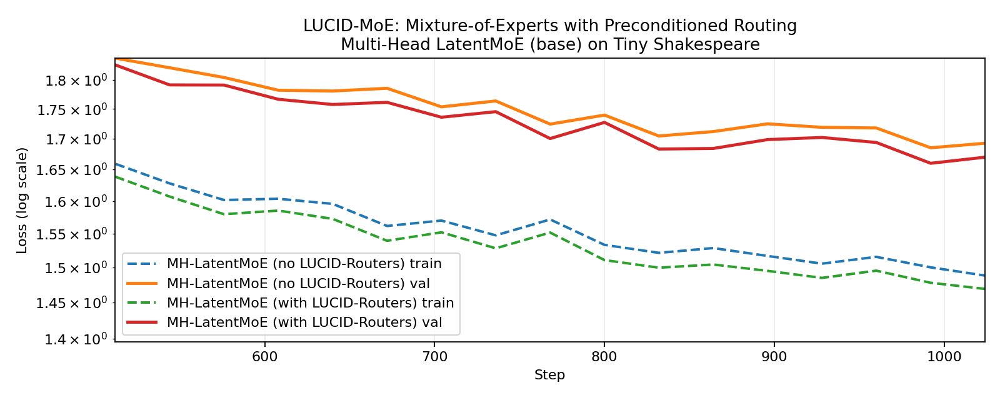
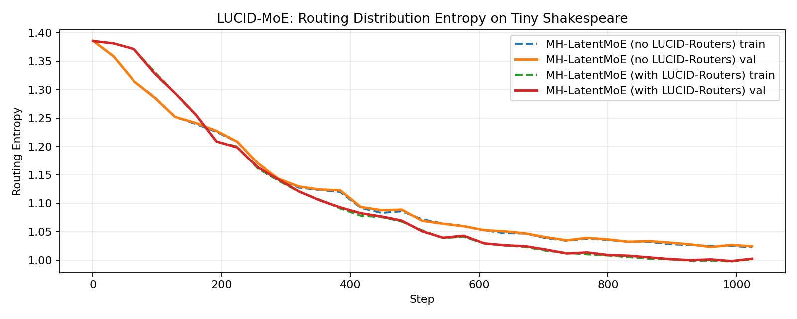

## 1. Introduction

Standard Softmax Attention has a long-context problem: the longer the context is, the more it loses 'focus' on relevant information. As argued by the LUCID Attention paper ([Duvvury et al., 2026](https://www.arxiv.org/abs/2602.10410)), this is primarily because it 'diffuses' attention across correlated tokens, even if those tokens are merely "similar but irrelevant". And the longer the context is, the more likely it is to have many correlated tokens, which leads to a more severe loss of focus. To fix this, they propose adjusting the attention scores with a preconditioner $P^{-1}$ that "undoes" the effect of correlation before applying the value aggregation. Think of it as a whitening step, but for attention scores instead of gradients as in Muon.

$$\begin{align}
    \texttt{Softmax-Attn}(Q, K, V)
        &= \text{softmax}\left( M \circ \exp(QK^T) \right) V \\
    \texttt{LUCID-Attn}(Q, K, V)
        &= \text{softmax}\left( M \circ \exp(QK^T) \right) \underbrace{\left( M \circ \exp(KK^T) \right)^{-1}}_{P^{-1}} V
\end{align}$$

More intuitively, think softmax attention as a retrieval operation where we have a "query" $q$ (the representation of the current token), and we want to use it to "retrieve" the closest "keys" $K$ (representations of context tokens). The operation,
$$\begin{align}
    qK^T
        &= \begin{bmatrix}
            qk_1^T & qk_2^T & \cdots & qk_N^T
        \end{bmatrix} \\
        &= \begin{bmatrix}
            \text{similarity}(q, k_1) & \text{similarity}(q, k_2) & \cdots & \text{similarity}(q, k_N)
        \end{bmatrix},
\end{align}$$
computes the "similarity" between the query and each key, and the softmax afterwards makes them positive (via exponentiation) and sums to 1 (via normalization), yielding a probability distribution over the keys,
$$\begin{align}
    p(k_i \text{ gets picked}) = \text{softmax}(qK^T)_i = \frac{\overbrace{\exp(\text{similarity}(q, k_i))}^{> 0}}{\sum_{j=1}^N \exp(\text{similarity}(q, k_j))}.
\end{align}$$

Ideally, we only want to "pick" the key or keys that are closest (highest similarity) to the query, and ignore the rest. However, if there are $N$ tokens that are similar to the closest key, but (perhaps slightly) farther away from the query, then the softmax will still assign all of them roughly equal attention scores, despite not all of them being relevant. Or they could even be irrelevant, but redundant. Either way, they are distracting and should be ignored. And the longer the context is, the larger $N$ is, the worse the problem becomes. Hence the attention score whitening step to "undo" the effect of key correlations:
$$\begin{align}
    P^{-1}
        &= \begin{bmatrix}
            \text{similarity}(k_1, k_1) & 0 & \cdots & 0 \\
            \text{similarity}(k_1, k_2) & \text{similarity}(k_2, k_2) & \cdots & 0 \\
            \vdots & \vdots & \ddots & \vdots \\
            \text{similarity}(k_1, k_N) & \text{similarity}(k_2, k_N) & \cdots & \text{similarity}(k_N, k_N)
        \end{bmatrix}^{-1}
\end{align}$$

In this blog post, we argue that LUCID's preconditioning step also helps in any "retrieve most-relevant information via dot-product and softmax" setting, such as:
1. Mixture of Experts (MoE) routing, where the "queries" are token representations, the "keys" are expert representations, and the "values" are the expert outputs.
2. Retrieval-augmented generation, where the "queries" are token representations, the "keys" are retrieved document representations, and the "values" are the retrieved document contents.
3. The Language Model Head of a transformer, where the "queries" are token representations, the "keys" are token embeddings, and $V=I$.

We will focus on the first setting, MoE routing, because the preconditioners $P$ are typically small and thus more tractable to invert. All three settings above do not have the lower-triangular structure as in attention, and the latter two have much larger $P$s, making this trick infeasible.

## 2. LUCID-MoE

The routers in Mixture-of-Experts are "attention-like" in the sense that, modulo top-K sparsity, they also compute dot-product similarities between token representations $X$ and expert representations $E$, followed by a softmax to get the routing probabilities. Thus, they suffer from having "diffused" routing probabilities across correlated experts, which lead to less-specialized experts, and worse performance when some of the redundant experts do not get picked in the top-K filter. The simple fix then is to apply the same preconditioning step as in LUCID Attention, which "undoes" the effect of expert correlation before applying the expert outputs $O$:
$$\begin{align}
    \texttt{Softmax-Routing}(X, E, O)
        &= \text{softmax}\left( X E^T \right) O \\
    \texttt{LUCID-Routing}(X, E, O)
        &= \text{softmax}\left( X E^T \right) P^{-1} O,
\end{align}$$
with,
$$\begin{align}
    P^{-1}
        &= \left( E E^T \right)^{-1}
        = \begin{bmatrix}
            \text{similarity}(e_1, e_1) & \text{similarity}(e_2, e_1) & \cdots & \text{similarity}(e_N, e_1) \\
            \text{similarity}(e_1, e_2) & \text{similarity}(e_2, e_2) & \cdots & \text{similarity}(e_N, e_2) \\
            \vdots & \vdots & \ddots & \vdots \\
            \text{similarity}(e_1, e_N) & \text{similarity}(e_2, e_N) & \cdots & \text{similarity}(e_N, e_N)
        \end{bmatrix}^{-1}.
\end{align}$$

## 3. Experiments

Here we train a 2-layer Latent-MoE model ([Cui et al., 2026](https://arxiv.org/abs/2602.04870v1)) on TinyShakespeare, with 32 experts, top-4 routing, and 128 hidden dimension per expert with the Muon optimizer ([Jordan et al., 2024](https://kellerjordan.github.io/posts/muon/)). We observe that LUCID-MoE achieves better validation loss and lower expert entropy, indicating more specialized experts, than the standard MoE baseline.





## How to cite

```bibtex
@misc{cesista2026lucidmoe,
  author = {Franz Louis Cesista},
  title = {{LUCID-MoE}: Mixture of Experts with Preconditioned Routing},
  year = {2026},
  month = {February},
  day = {15},
  url = {https://leloykun.github.io/ponder/lucid-moe/},
}
```

## References

1. Sai Surya Duvvuri, Nirmal Patel, Nilesh Gupta, Inderjit S. Dhillon (2026). LUCID: Attention with Preconditioned Representations. URL https://www.arxiv.org/abs/2602.10410
2. Chenwei Cui, Rockwell Jackson, Benjamin Joseph Herrera, Ana María Tárano, Hannah Kerner (2026). Multi-Head LatentMoE and Head Parallel: Communication-Efficient and Deterministic MoE Parallelism. URL https://arxiv.org/abs/2602.04870v1
3. Keller Jordan, Yuchen Jin, Vlado Boza, Jiacheng You, Franz Cesista, Laker Newhouse, and Jeremy Bernstein (2024). Muon: An optimizer for hidden layers in neural networks. Available at: https://kellerjordan.github.io/posts/muon/.
