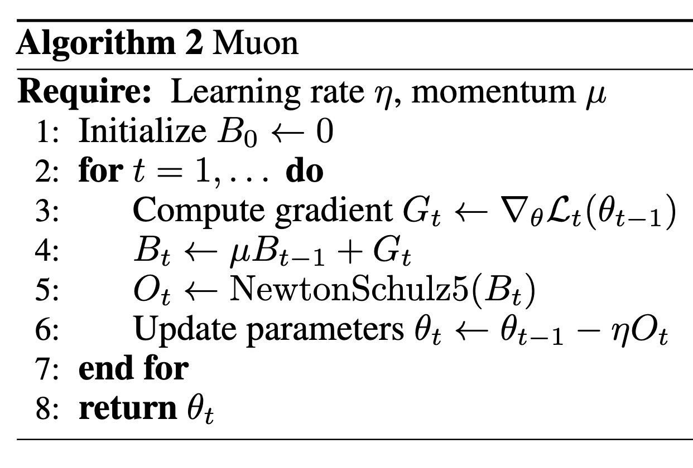

## What's Muon?

Muon is an optimizer for 2D parameters that approximately semi-orthogonalizes the gradient first using Newton-Schulz iteration before using it to update the parameters.

<div align="center">
    
</div>

## Why semi-orthogonalize the gradients first?

1. Because this is the update rule you get if you turn off the preconditioner accumulation of 2nd order algorithms like Shampoo or its variants like CASPR. In theory, you can do this if you assume that your batch size is large enough for you to have enough information to have a proper estimate of the Hessian.

2. You can think of Muon as doing steepest descent under the spectral norm. Why the spectral norm? Because it's the operator norm you induce on the parameters if your inputs and outputs are Euclidean/RMS-normed--which is a very reasonable assumption. And

3. Because it works well in practice ;P


For more details, I'd recommend reading [Keller's writeup on Muon](https://kellerjordan.github.io/posts/muon/) and [Jeremy's paper on steepest descent under operator norms](https://arxiv.org/abs/2409.20325).

## Why does Muon still work well despite only approximately semi-orthogonalizing the gradients?

The reason we don't need to perfectly semi-orthogonalize the gradients is that we can recast Muon as steepest descent under Schatten-p norm.

- The Schatten-2 norm is just the Frobenius norm. Thus, steepest descent under that normed space is equivalent to the usual stochastic gradient descent. And
- The Schatten-$\infty$ norm is just the Spectral norm. Thus, steepest descent under that normed space is equivalent to spectral gradient descent or... Muon with perfect semi-orthogonalization.

And if we interpolate, all of the directions from the original gradient to its nearest semi-orthogonal matrix are all good descent directions!

## What's the problem with the original coefficients of Muon?

As you can see below, Muon's Newton-Schulz iteration actually introduces a lot of noise to the resulting singular values--too much variance!


And if my maths is correct, if you were doing steepest descent under the Schatten-32 norm instead, the spread of the resulting singular values would be about the same. So, in a sense, you can interpret Muon with the old coefficients as doing steepest descent under the Schatten-32 norm.

## How do we optimize the coefficients?

Keller found the original coefficients using gradient descent with a bias for steep curves.

A key insight is that we don't have to use the same coefficients for all the Newton-Shultz iteration steps! We can initialize a `[NUM_STEPS, 3]` matrix and do gradient descent to find the optimal coefficients. We can even use Muon to improve itself!


You Jiaching, Keller Jordan, & I actually experimented a lot on this a few months ago when we only had the GPT2-small track. But we didn't get any improvements with the trick, so we abandoned it. It's only now that we have a GPT2-medium track that this has started to be useful.

---

I also added a couple of auxiliary losses for improved stability and aesthetics. E.g.:

1. The peak of the previous iteration must be less than the right fixed point of the current iteration. Otherwise, the singular values are going to blow up.

2. The trough of the current iteration must not cross the x-axis. Otherwise, the singular values are gonna switch signs.

3. The coefficients must be small and be stable even when truncating the decimals.

4. For aesthetics, I constrained the attractor basins to grow smaller at each step.

Etc.

## Takeaways for Optimizer Researchers

1. In early training, the 'steepness' of the curve matters more than noise reduction. This is because the stable rank of the gradients tends to be smaller in early training.

2. But noise reduction matters more for longer training runs. I.e., having a smaller variance in the resulting singular values after NS iterations results in lower loss overall.

## Code

```python
"""
Tool for optimizing the coefficients of the Newton-Schulz iterators in Muon.

Usage notes:
- Use a high `epsilon` value to prevent the singular values from either blowing up or switching signs.
- Set --enable_flatness_aux_loss to get flatter composite curves.
"""

import argparse
from functools import partial

import jax
import jax.numpy as jnp
import optax
import sympy as sp

DEFAULT_EPS = 1. / 16
DEFAULT_PRECISION = 4

gamma_ = sp.Symbol("gamma", interval=(5/4, sp.S.Infinity), left_open=True, right_open=True)
l_ = sp.Symbol("l", interval=(0, 1), left_open=False, right_open=True)
r_ = sp.Symbol("r", interval=(0, 1), left_open=False, right_open=True)
x_ = sp.Symbol("x", real=True)

fp_ = [-(1 + r_), -(1 - l_), 0, 1 - l_, 1 + r_]
iterator_ = x_ + gamma_ * (x_ - fp_[0])*(x_ - fp_[1])*(x_ - fp_[2])*(x_ - fp_[3])*(x_ - fp_[4])
iterator_simplified_ = sp.collect(sp.expand(iterator_), x_)

abc_iterator_jax = jax.jit(lambda x, a, b, c: a*x + b*x**3 + c*x**5)
glr_iterator_jax = sp.lambdify((x_, gamma_, l_, r_), iterator_simplified_, "jax")

a_, b_, c_ = sp.Poly(iterator_simplified_, x_).coeffs()[::-1]
a_jax = sp.lambdify((gamma_, l_, r_), a_, "jax")
b_jax = sp.lambdify((gamma_, l_, r_), b_, "jax")
c_jax = sp.lambdify((gamma_, l_, r_), c_, "jax")


def abc_to_glr_reparam(a: float, b: float, c: float, verbose: bool = False):
    iterator_fn = a*x_ + b*x_**3 + c*x_**5
    iterator_roots = sp.nroots(iterator_fn - x_)
    if verbose:
        print(iterator_roots)
    iterator_roots_real = [root.evalf() for root in iterator_roots if root.is_real]
    iterator_roots = sorted(iterator_roots_real)
    return float(c), float(1 - iterator_roots[-2]), float(iterator_roots[-1] - 1)


@partial(jax.jit, static_argnames=("decimals",))
def glr_to_abc_reparam(gamma: float, l: float, r: float, decimals: int = 4):
    abc = jnp.stack([a_jax(gamma, l, r), b_jax(gamma, l, r), c_jax(gamma, l, r)])
    return abc + jax.lax.stop_gradient(jnp.round(abc, decimals) - abc)


def loss(
    x: jax.Array,
    params: jax.Array,
    eps: float = DEFAULT_EPS,
    precision: int = DEFAULT_PRECISION,
    enable_contraction_aux_loss: bool = True,
    enable_flatness_aux_loss: bool = False,
):
    def scan_body_fn(y: jax.Array, glr: jax.Array):
        gamma, l, r = glr

        # The peak of the previous iteration should be at most 1 + r - eps
        # to prevent singular values from blowing up
        intermediate_loss = jnp.clip(y.max() - (1 + r - eps), min=0)

        a, b, c = glr_to_abc_reparam(gamma, l, r, precision)
        new_y = abc_iterator_jax(y, a, b, c)

        # The iterator must not cross the x-axis
        # to prevent singular values from switching signs
        intermediate_loss += jnp.clip(eps - jnp.amin(jnp.where(y > 0.5, new_y, jnp.inf)), min=0)

        return new_y, intermediate_loss
    y, intermediate_losses = jax.lax.scan(scan_body_fn, x, params)

    # This auxiliary loss term encourages the contraction of the
    # attractor basins of the iterators
    aesthetic_aux_loss = (
        jnp.clip(params[1:,2] - params[:-1,2], min=0).sum()
        + jnp.clip(params[1:,1] - params[:-1,1], min=0).sum()
        + jnp.clip(params[1:,0] - params[:-1,0], min=0).sum()
    )

    # This auxiliary loss term encourages the flatness of the composite curve
    # Taken from @YouJiacheng's code here: https://gist.github.com/YouJiacheng/393c90cbdc23b09d5688815ba382288b
    y_max = jnp.amax(y)
    y_min = jnp.amin(jnp.where(x > 0.05, y, jnp.inf))
    diff_ratio = (y_max - y_min) / jnp.clip(y_max, min=1e-3)

    loss1 = jnp.sqrt(jnp.mean((y - 1) ** 2))
    loss2 = (
        intermediate_losses.mean()
        + jnp.int32(enable_contraction_aux_loss) * aesthetic_aux_loss
        + jnp.int32(enable_flatness_aux_loss) * diff_ratio
    )
    return loss1 + loss2


loss_and_grad_fn = jax.jit(jax.value_and_grad(loss, argnums=1), static_argnums=(2, 3, 4, 5))


@partial(jax.jit, static_argnums=(2, 3, 4, 5, 6))
def train(
    x: jax.Array,
    params: jax.Array,
    learning_rate: float = 0.001,
    num_steps: int = 10_000,
    eps: float = DEFAULT_EPS,
    precision: int = DEFAULT_PRECISION,
    enable_contraction_aux_loss: bool = True,
    enable_flatness_aux_loss: bool = False,
):
    optimizer = optax.chain(
        # can also use optax.contrib.muon
        optax.adam(learning_rate=learning_rate),
        optax.clip_by_global_norm(max_norm=1.),
    )
    opt_state = optimizer.init(params)

    def body_fn(values: tuple[jax.Array, optax.OptState], _):
        params, opt_state = values
        loss, grad = loss_and_grad_fn(
            x,
            params,
            eps,
            precision,
            enable_contraction_aux_loss,
            enable_flatness_aux_loss,
        )
        updates, opt_state = optimizer.update(grad, opt_state, params)
        new_params = optax.apply_updates(params, updates)
        return (new_params, opt_state), (params, loss)
    (params, _), (historical_params, losses) = jax.lax.scan(body_fn, (params, opt_state), length=num_steps)
    return params, historical_params, losses


if __name__ == "__main__":
    parser = argparse.ArgumentParser()
    parser.add_argument(
        "--num_ns_iters", help="Number of Newton-Schulz iterations", type=int, default=5
    )
    parser.add_argument(
        "--num_train_steps", help="Number of training steps", type=int, default=10_000
    )
    parser.add_argument(
        "--learning_rate", help="Learning rate", type=float, default=0.001
    )
    parser.add_argument(
        "--precision", help="Number of decimals in the coefficients", type=int, default=DEFAULT_PRECISION
    )
    parser.add_argument(
        "--eps", help="Epsilon", type=float, default=DEFAULT_EPS
    )
    parser.add_argument(
        "--enable_contraction_aux_loss", help="Enable contraction auxiliary loss", action="store_true", default=True
    )
    parser.add_argument(
        "--enable_flatness_aux_loss", help="Enable flatness auxiliary loss", action="store_true", default=False
    )
    args = parser.parse_args()

    print(args)

    # Reparametrize Keller Jordan's a-b-c coefficients to gamma-l-r
    kj_a, kj_b, kj_c = 3.4445, -4.7750, 2.0315
    kj_gamma, kj_inner_radius, kj_outer_radius = abc_to_glr_reparam(kj_a, kj_b, kj_c)
    # Check if the reparametrization is correct
    kj_abc = glr_to_abc_reparam(kj_gamma, kj_inner_radius, kj_outer_radius, decimals=4)
    assert jnp.allclose(kj_abc, jnp.array([kj_a, kj_b, kj_c]), atol=1e-4)

    x = jnp.concat([
        # The extra 0.1 is there to account for numerical instability
        jnp.linspace(0, 1.1, 2**10),
        # Gradients typically have low stable rank (i.e. most of the singular values are close to 0).
        # To simulate that, we add a couple more points near 0.
        jnp.linspace(0, 0.1, 2**9),
    ])
    init_params = jnp.array([[kj_gamma, kj_inner_radius, kj_outer_radius]]*args.num_ns_iters)

    trained_params, historical_params, losses = train(
        x=x,
        params=init_params,
        learning_rate=args.learning_rate,
        num_steps=args.num_train_steps,
        eps=args.eps,
        precision=args.precision,
        enable_contraction_aux_loss=args.enable_contraction_aux_loss,
        enable_flatness_aux_loss=args.enable_flatness_aux_loss,
    )

    best_params: jax.Array = historical_params[jnp.nanargmin(losses)]

    steepness = 1.
    for gamma, l, r in best_params:
        a, b, c = glr_to_abc_reparam(gamma, l, r, args.precision)
        print(f"({a:.4f}, {b:.4f}, {c:.4f})")
        steepness *= a
    print(f"Steepness: {steepness: .4f}")
```

## How to Cite

```bibtex
@misc{cesista2025muonoptcoeffs,
  author = {Franz Louis Cesista and You Jiacheng and Keller Jordan},
  title = {{S}queezing 1-2% Efficiency Gains Out of {M}uon by Optimizing the {N}ewton-{S}chulz {C}oefficients},
  year = {2025},
  month = {February},
  day = {21},
  url = {https://leloykun.github.io/ponder/muon-opt-coeffs/},
}
```

## References

1. Keller Jordan, Jeremy Bernstein, Brendan Rappazzo, @fernbear.bsky.social, Boza Vlado, Jiacheng You, Franz Cesista, Braden Koszarsky, and @Grad62304977. modded-nanogpt: Speedrunning the NanoGPT baseline. 2024. Available at: https://github.com/KellerJordan/modded-nanogpt.
2. Keller Jordan, Yuchen Jin, Vlado Boza, Jiacheng You, Franz Cesista, Laker Newhouse, and Jeremy Bernstein (2024). Muon: An optimizer for hidden layers in neural networks. Available at: https://kellerjordan.github.io/posts/muon/.
3. Surya, S., Duvvuri, Devvrit, F., Anil, R., Hsieh, C., & Dhillon, I.S. (2024). Combining Axes Preconditioners through Kronecker Approximation for Deep Learning. International Conference on Learning Representations.
4. Vineet Gupta, Tomer Koren, Yoram Singer (2018). Shampoo: Preconditioned Stochastic Tensor Optimization. URL https://arxiv.org/abs/1802.09568
5. Rohan Anil, Vineet Gupta, Tomer Koren, Kevin Regan, Yoram Singer (2020). Scalable second order optimization for deep learning. URL https://arxiv.org/abs/2002.09018
6. Jeremy Bernstein, Laker Newhouse (2024). Old Optimizer, New Norm: An Anthology. URL https://arxiv.org/abs/2409.20325
7. Jeremy Bernstein (2024). "Weight erasure." Available at: https://docs.modula.systems/examples/weight-erasure/
8. Franz Louis Cesista (2025). CASPR Without Accumulation is Muon. URL https://leloykun.github.io/ponder/caspr-wo-accum-is-muon/
