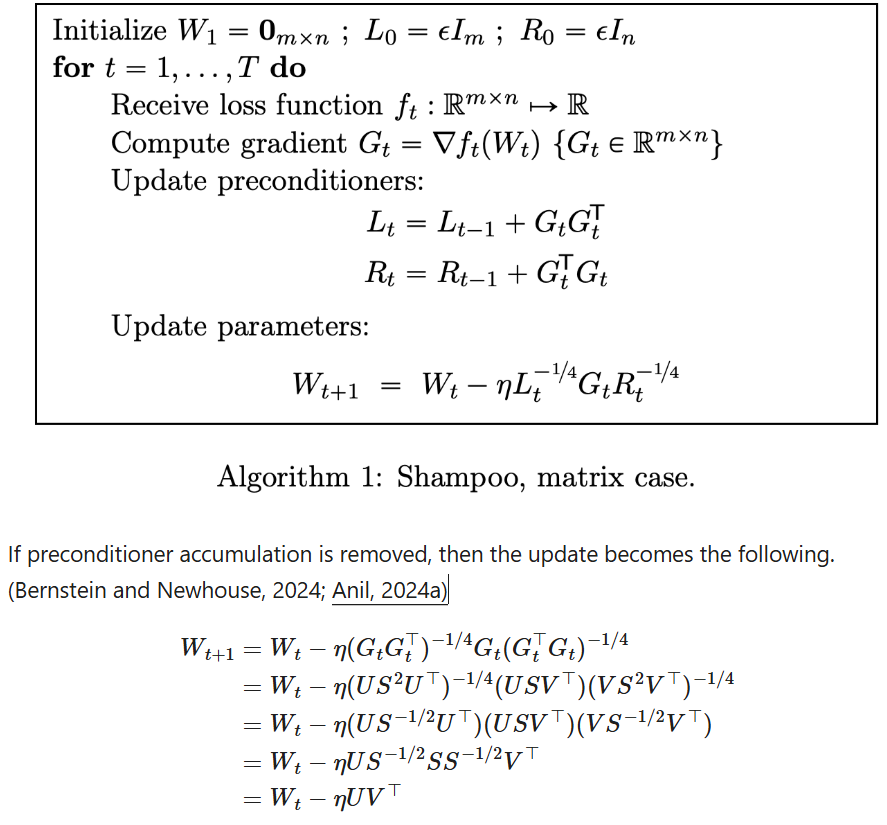
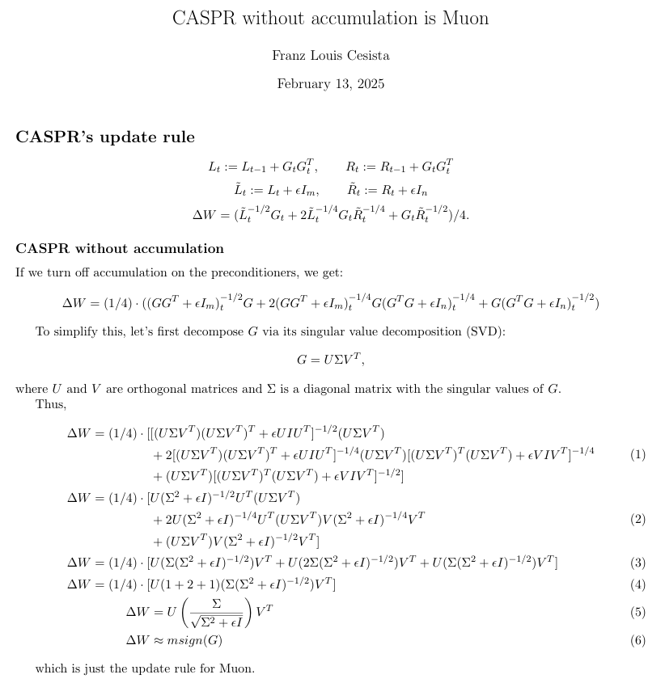
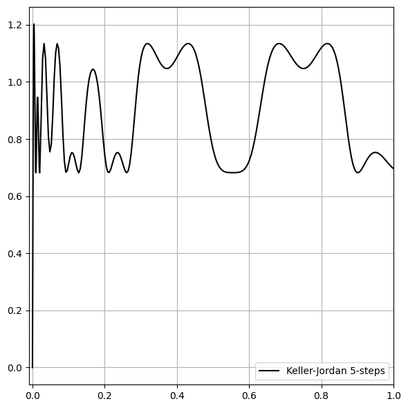
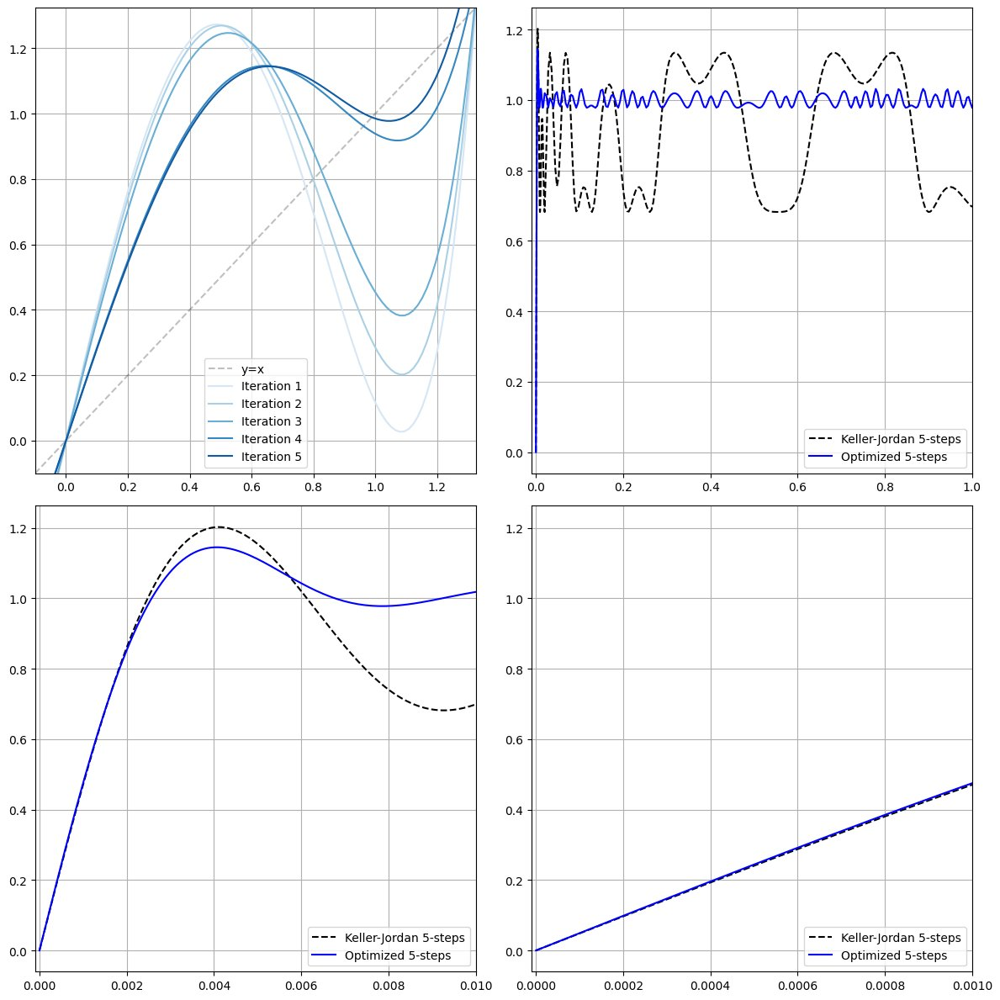

> Site is currently under construction. For now, you can read the original X/Twitter thread here: https://x.com/leloykun/status/1892793848163946799

---

## What's Muon?

Muon is an optimizer for 2D parameters that approximately semi-orthogonalizes the gradient (using Newton-Schulz iteration) first before using it to update the parameters.

<div align="center">
    
</div>

## Why semi-orthogonalize the gradients first?

1. Because this is the update rule you get if you turn off the preconditioner accumulation of 2nd order algorithms like Shampoo or its variants like CASPR. In theory, you can do this if you assume that your batch size is large enough for you to have enough information to have a proper estimate of the hessian.

2. You can think of Muon as doing steepest descent under the spectral norm. Why the spectral norm? Because it's the operator norm you induce on the parameters if your inputs and outputs are Euclidean/RMS-normed--which is a very reasonable assumption. And

3. Because it works well in practice ;P

<div align="center">
    
</div>

<div align="center">
    
</div>

For more details, I'd recommend reading [Keller's writeup on Muon](https://kellerjordan.github.io/posts/muon/) and [Jeremy's paper on steepest descent under operator norms](https://arxiv.org/abs/2409.20325).

## Why does Muon still work well despite only approximately semi-orthogonalizing the gradients?

The reason we don't need to perfectly semi-orthogonalize the gradients is that we can recast Muon as steepest descent under Schatten-p norm.

- The Schatten-2 norm is just the Frobenius norm. Thus, steepest descent under that normed space is equivalent to the usual stochastic gradient descent. And
- The Schatten-$\infty$ norm is just the Spectral norm. Thus, steepest descent under that normed space is equivalent to spectral gradient descent or... Muon with perfect semi-orthogonalization.

And if we interpolate, all of the directions from the original gradient to its nearest semi-orthogonal matrix are all good descent directions!

## What's the problem with the original coefficients of Muon?

As you can see below, Muon's Newton-Schulz iteration actually introduces a lot of noise to the resulting singular values--too much variance!

<div align="center">
    
</div>

And if my maths is correct, if you were doing steepest descent under the Schatten-4 norm instead, the spread of the resulting singular values would be about the same. So, in a sense, you can interpret Muon with the old coefficients as doing steepest descent under the Schatten-4 norm.

## How do we optimize the coefficients?

Keller found the original coefficients using gradient descent with a bias for steep curves.

A key insight is that we don't have to use the same coefficients for all the newton-shultz iteration steps! We can initialize a `[NUM_STEPS, 3]` matrix and do gradient descent to find the optimal coefficients. We can even use Muon to improve itself!

<div align="center">
    
</div>

YouJiaching, Keller, & I actually experimented a lot on this a few months ago when we only had the GPT2-small track. But we didn't get any improvements with the trick, so we abandoned it. It's only now that we have a GPT2-medium track that this has started to be useful.

---

I also added a couple of auxiliary losses for improved stability and aesthetics. E.g.:

1. The peak of the previous iteration must be less than the right fixed point of the current iteration. Otherwise, the singular values are going to blow up.

2. The through of the current iteration must not cross the x-axis. Otherwise, the singular values are gonna switch signs.

3. The coefficients must be small and be stable even when truncating the decimals.

4. For aesthetics, I constrained the attractor basins to grow smaller at each step.

And etc.

## Takeaways for Optimizer Researchers

1. In early training, the 'steepness' of the curve matters more than noise reduction. This is because the stable rank of the gradients tends to be smaller in early training.

2. But noise reduction matters more for longer training runs. I.e., having a smaller variance in the resulting singular values after NS iterations results in lower loss overall.

## How to Cite

```bibtex
@misc{cesista2024muonoptcoeffs,
  author = {Franz Louis Cesista},
  title = {Squeezing 1-2% Efficiency Gains Out of Muon by Optimizing the Newton-Schulz Coefficients},
  year = {2025},
  url = {http://leloykun.github.io/ponder/muon-opt-coeffs/},
}
```
