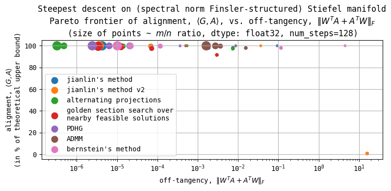

> If you find this post useful, please consider supporting my work by sponsoring me on GitHub: [![Sponsor on GitHub][sponsor-badge]][sponsor-link]

[sponsor-badge]: https://img.shields.io/badge/🤝-Sponsor%20me-1da1f2?logo=github&style=flat-square
[sponsor-link]: https://github.com/sponsors/leloykun

## 1. Introduction

In this blog post, we shall consider the problem of steepest descent on [Finsler-structured (matrix) manifolds](https://en.wikipedia.org/wiki/Finsler_manifold). This problem naturally arises in deep learning optimization because we want model training to be *fast* and *robust*. That is, we want our weight updates to maximally change activations (or outputs) while keeping both activations and weights stable.

As discussed in [prior](../steepest-descent-opt/) [blog](../steepest-descent-non-riemannian/) [posts](../steepest-descent-finsler/) and our [latest paper](https://arxiv.org/abs/2507.13338), we can achieve this by properly considering the geometry in which to 'place' our weights in. This then begs the questions,

1. *Which* geometry should we 'place' our weights in? And,
2. *How* do we perform optimization in this geometry?

For (1), note that we have *two* degrees of freedom here: the choice of the underlying manifold and the choice of metric or norm to equip to the tangent spaces of the manifold. The latter makes (2) tricky because the manifold we end up with could not only be non-Euclidean but even non-Riemannian--and work on non-Riemannian optimization is scarce to almost non-existent.

While it might seem that we're just inventing a difficult problem for bored mathematicians to solve, we will show in the next sections that we can motivate such problems with simple arguments and even lead to 1.5x to 2x speedup in large-scale LLM training.

This blog post generalizes work by [Jeremy Bernstein](https://docs.modula.systems/algorithms/manifold/stiefel/) and [Jianlin Su](https://kexue.fm/archives/11221) on 'Stiefel Muon' to optimization on Finsler-structured (matrix) manifolds.

## 2. Case studies

### 2.1. Case study #1: Muon



Following [Bernstein & Newhouse (2024)](https://arxiv.org/abs/2409.20325), here is a minimal construction of the [Muon optimizer (Jordan et al., 2024)](https://kellerjordan.github.io/posts/muon/):

1. Take $\mathbb{R}^{m \times n}$
2. Equip the tangent spaces with the spectral norm
3. Do first-order optimization on the resulting manifold
4. Add momentum

But why choose the spectral norm in the first place? Why not the simpler Frobenius norm?

As we discussed in previous [blog](../steepest-descent-non-riemannian/) [posts](../steepest-descent-finsler/),
> If we want the "natural" norm of our features and feature updates to be stable regardless of the model size,
> then the "natural" norm of our weights and weight updates must also be stable regardless of the model size.

where the 'natural' feature norm here is the RMS norm or the scaled Euclidean norm while the 'natural' weight norm is the RMS-to-RMS norm or the scaled spectral norm.

Note that the spectral norm does not satisfy the [Parallelogram Law](https://en.wikipedia.org/wiki/Parallelogram_law) and so it is not induced by an inner product and therefore non-Riemannian. It does, however, induce a Finsler-structure on the manifold--an example of what we're trying to generalize here!



### 2.2. Case study #2: steepest descent on spectral norm Finsler-structured spectral norm ball around the origin



In our latest paper titled, [Training Transformers with Enforced Lipschitz Bounds](https://arxiv.org/abs/2507.13338), we provide methods for keeping the weight norms regulated in addition to using the Muon optimizer. Although we did not explicitly mention it, one can interpret our approach as performing steepest descent on the spectral norm Finsler-structured spectral norm ball around the origin. Inside the norm ball, the space is locally similar to the previous case. But whenever the weights get sent outside of the norm ball, we retract them back via the weight norm controls we introduced in our paper.



### 2.3. Case study #3: steepest descent on spectral norm Finsler-structured Stiefel manifold

The problem Jeremy, Jianlin, and I have been trying to solve then is this:
> Given the current weight $W \in \texttt{St}(m, n)$ and a "raw gradient" we get via e.g. backpropagation $G \in \mathbb{R}^{m \times n}$, we want to find the optimal update $A^\*$ such that,
> $$\begin{equation}
    A^\* = \arg\max\_{A \in \mathbb{R}^{m \times n}} \langle G, A \rangle \quad \text{ s.t. } \quad \\| A \\|\_{2 \to 2} \leq 1,\quad A \in T\_{W}\texttt{St}(m, n)
\end{equation}$$

Inspired by a partial solution by Jianlin (which did not yet work at the time), I proposed [heuristic solutions here](../steepest-descent-stiefel/). Jianlin then [solved the problem](https://kexue.fm/archives/11221) via a fixed-point iteration method. Finally, Jeremy proposed a [more general solution](https://docs.modula.systems/algorithms/manifold/stiefel/) via the dual ascent algorithm. [Cédric Simal](https://scholar.google.com/citations?user=Vo3M-WIAAAAJ&hl) also independently proposed studying the dual problem to me and Jeremy.

## 3. General solution via block-wise Primal-Dual Hybrid Gradient (PDHG) algorithm

### 3.1. Problem statement

Let $\mathcal{M}$ be a (matrix) manifold and $\\| \cdot \\|$ be a Finsler norm defined on the tangent spaces of $\mathcal{M}$, both chosen a priori. We want to solve the problem,
> Given the current weight $W \in \mathcal{M}$ and a "raw gradient" or differential we get via e.g. backpropagation $G \in T\_{W}^\*\mathcal{M} \subseteq \mathbb{R}^{m \times n}$, we want to find the optimal update $A^\* \in T\_{W}\mathcal{M} \subseteq \mathbb{R}^{m \times n}$ such that,
> $$\begin{equation} A^\* = \arg\max\_{A \in \mathbb{R}^{m \times n}} \langle G, A \rangle \quad \text{ s.t. } \quad \\| A \\|\_{W} \leq \eta,\quad A \in T\_{W}\mathcal{M} \end{equation}$$
> where $\eta > 0$ is the learning rate parameter.

The $\langle \cdot, \cdot \rangle: T^\*\_{W}\mathcal{M} \times T\_{W}\mathcal{M} \to \mathbb{R}$ operator above is *not* an inner product, but the canonical pairing between the cotangent and tangent spaces. It holds no geometric meaning by itself. However, in the standard basis of $R^{m \times n}$, it *behaves like* the Frobenius/Euclidean inner product.

### 3.2. Convex optimization approach

First, notice that the feasible sets for the constraints on $A$ above are convex, regardless of where we currently are in the manifold. And so we can frame this problem squarely as a convex optimization problem.

> Note: an intuitive, but incorrect approach is to simply project $G$ onto the (convex) intersection. First, this projection often does not have a closed-form solution. And second, it is suboptimal. Counterexample: suppose that $A=G$ is already in the intersection and $\langle G, A \rangle > 0$, but $\\| A \\|\_{W} = 0.5\eta$. Then $2A$ must also be in the intersection, but $\langle G, 2A \rangle > \langle G, A \rangle$. Hence, naive projection onto the intersection is suboptimal.

There are many ways to solve this problem such as Alternating Direction Method of Multipliers (ADMM), Douglas-Rachford, and etc. In this blog post, we will focus on the Primal-Dual Hybrid Gradient (PDHG) method.

First, replace the constraints with indicator functions,
$$\begin{equation} A^\* = -\arg\min\_{A \in \mathbb{R}^{m \times n}} \left\\{ \langle G, A \rangle + \mathcal{i}\_{\\| \cdot \\|\_{W} \leq \eta}(A) + \mathcal{i}\_{T\_{W}\mathcal{M}}(A) \right\\} \end{equation}$$
where,
$$ \mathcal{i}\_{\\| \cdot \\|\_{W} \leq \eta}(A) =
\begin{cases}
    0 &\text{ if } \\| A \\|\_{W} \leq \eta \\\\
    \infty &\text{ otherwise}
\end{cases}
\qquad \text{ and } \qquad
\mathcal{i}\_{T\_{W}\mathcal{M}}(A) =
\begin{cases}
    0 &\text{ if } A \in T\_{W}\mathcal{M} \\\\
    \infty &\text{ otherwise}
\end{cases}
$$

Equivalently,
$$\begin{equation} A^\* = -\arg\min\_{A \in \mathbb{R}^{m \times n}} \left\\{ f\_{\eta}(A) + g(A) \right\\} \end{equation}$$
where $f\_{\eta}(\cdot) := \mathcal{i}\_{\\| \cdot \\|\_{W} \leq \eta}(\cdot)$ and $g(\cdot) := \mathcal{i}\_{T\_{W}\mathcal{M}}(\cdot) + \langle G, \cdot \rangle$. Note that we can move the $\langle G, \cdot \rangle$ term to $f$ instead, but as we will see later, the proximal operator for $g$ is simpler so we keep it there for improved numerical stability.

We can then split Equation (4) into two subproblems by 'copying' $A$,
$$\begin{equation} A^\* = -\left[\arg\min\_{A,B \in \mathbb{R}^{m \times n}} \\{f\_{\eta}(A) + g(B)\\} \quad \text{ s.t. } \quad A - B = 0\right]\_{A} \end{equation}$$
This effectively blows up our solution search space, but one can easily prove that the optimal solution to the problem above also solves our original problem!

### 3.3. Recasting as a primal-dual problem

Define,
$$
\begin{align*}
    X &:= \begin{bmatrix}
        A \\\\
        B
    \end{bmatrix}\\\\
    L &:= \begin{bmatrix} I & -I \end{bmatrix} \\\\
    \mathcal{F}\_{\eta}(X) &:= f\_{\eta}(A) + g(B) \\\\
    \mathcal{G}(Y) &:= \mathcal{i}\_{\\{0\\}}(Y) = \begin{cases}
        0 &\text{ if } Y = 0 \\\\
        \infty &\text{ otherwise}
    \end{cases}
\end{align*}
$$
where $X \in \mathcal{X} = \mathbb{R}^{2m \times n}$, $Y \in \mathcal{Y} = \mathbb{R}^{m \times n}$, $L: \mathcal{X} \to \mathcal{Y}$ is a linear operator, $\mathcal{F}\_{\eta}: \mathcal{X} \to \mathbb{R}$, and $\mathcal{G}: \mathcal{Y} \to \mathbb{R}$.

Then Equation (5) can be rewritten to,
$$\begin{align}
    A^\* &= -\left[ \arg\min\_{X \in \mathcal{X}} \\{\mathcal{F}\_{\eta}(X) + \mathcal{G}(LX)\\} \right]\_{1}
\end{align}$$

Fenchel duality then yields the saddle problem,
$$\begin{align}
    \min\_{X \in \mathcal{X}} \max\_{Y \in \mathcal{Y}} \mathcal{L}(X,Y)
        &:= \mathcal{F}\_{\eta}(X) + \langle LX, Y \rangle - \mathcal{G}^\*(Y) \nonumber \\\\
        &\ = \mathcal{F}\_{\eta}(X) + \langle LX, Y \rangle
\end{align}$$
since $\mathcal{G}^\*(Y) = \sup\_{Z \in \mathcal{Y}} \\{ \langle Y, Z \rangle - \underbrace{\mathcal{G}(Z)}\_{=\infty \text{ if } Z \neq 0} \\} = \langle Y, 0 \rangle + \mathcal{G}(0) = 0$ for all $Y \in \mathcal{Y}$.

### 3.4. Block-wise Primal-Dual Hybrid Gradient

Following [ODL's page on PDHG](https://odlgroup.github.io/odl/math/solvers/nonsmooth/pdhg.html), we choose $\tau\_A, \tau\_B, \sigma > 0$, $\theta \in [0,1]$, and initialize $X\_0 \in \mathcal{X}$, $Y\_0 \in \mathcal{Y}$, and $\widetilde{X}\_0 = X\_0$. We then iterate,
$$\begin{align}
    Y\_{k+1} &= \texttt{prox}\_{\sigma \mathcal{G}^\*} (Y\_{k} + \sigma L \widetilde{X}\_{k}) \\\\
    X\_{k+1} &= \texttt{prox}\_{\tau \mathcal{F}\_{\eta}} (X\_{k} - \tau L^T Y\_{k+1}) \\\\
    \widetilde{X}\_{k+1} &= X\_{k+1} + \theta (X\_{k+1} - X\_{k})
\end{align}$$
where $\tau = \text{diag}(\tau\_A I\_m, \tau\_B I\_m)$ and $\texttt{prox}$ is the proximal operator.

To speed up convergence, we can also re-use the $X^\*$ and $Y^\*$ from the previous optimization step to initialize $X_0$ and $Y_0$. This is especially useful when e.g. using (nesterov) momentum on $G$, guaranteeing that the 'input gradients' do not vary too much.

#### 3.4.1. Converting proximal operators to projections

For the $Y$-variable,
$$\begin{align*}
    Y\_{k+1}
        &= \texttt{prox}\_{\sigma \mathcal{G}^\*} (Y\_{k} + \sigma L \widetilde{X}\_{k}) \\\\
        &= \arg\min\_{Y \in \mathcal{Y}} \left\\{ \sigma \cancel{\mathcal{G}^\*(Y)} + \frac{1}{2} \\| Y - (Y\_{k} + \sigma L \widetilde{X}\_{k}) \\|\_F^2 \right\\} \\\\
        &= Y\_{k} + \sigma L \widetilde{X}\_{k}
\end{align*}$$

For the $X$-variable,
$$\begin{align*}
    X\_{k+1}
        &= \texttt{prox}\_{\tau \mathcal{F}\_{\eta}} (X\_{k} - \tau L^T Y\_{k+1}) \\\\
        &= \arg\min\_{X \in \mathcal{X}} \left\\{ \tau \mathcal{F}\_{\eta}(X) + \frac{1}{2} \\| X - (X\_{k} - \tau L^T Y\_{k+1}) \\|\_F^2 \right\\} \\\\
        &= \arg\min\_{X \in \mathcal{X}} \left\\{ \tau\_A f\_{\eta}(A) + \tau\_B g(B) + \frac{1}{2} \left\\| \begin{bmatrix}
            A - (A\_k - \tau\_A Y\_{k+1}) \\\\
            B - (B\_k + \tau\_B Y\_{k+1})
        \end{bmatrix} \right\\|\_F^2 \right\\} \\\\
        &= \arg\min\_{X \in \mathcal{X}} \\{ \tau\_A f\_{\eta}(A) + \frac{1}{2} \left\\| A - (A\_k - \tau\_A Y\_{k+1}) \right\\|\_F^2 \\\\
        &\qquad\qquad + \tau\_B g(B) + \frac{1}{2} \left\\| B - (B\_k + \tau\_B Y\_{k+1}) \right\\|\_F^2 \\} \\\\
\end{align*}$$

Note that we can optimize for $A$ and $B$ separately and thus get,
$$\begin{align*}
    A\_{k+1}
        &= \arg\min\_{A \in \mathbb{R}^{m \times n}} \left\\{ \tau\_A f\_{\eta}(A) + \frac{1}{2} \left\\| A - (A\_k - \tau\_A Y\_{k+1}) \right\\|\_F^2 \right\\} \\\\
        &= \arg\min\_{\\| A \\|\_{W} \leq \eta} \left\\{ \frac{1}{2} \left\\| A - (A\_k - \tau\_A Y\_{k+1}) \right\\|\_F^2 \right\\} \\\\
        &= \texttt{proj}\_{\\| \cdot \\|\_{W} \leq \eta} (A\_k - \tau\_A Y\_{k+1}) \\\\
\end{align*}$$
where $\texttt{proj}\_{\\| \cdot \\|\_{W} \leq \eta}$ is the projection onto the ${\eta}$-norm ball. Likewise,
$$\begin{align*}
    B\_{k+1}
        &= \arg\min\_{B \in \mathbb{R}^{m \times n}} \left\\{ \tau\_B g(B) + \frac{1}{2} \left\\| B - (B\_k + \tau\_B Y\_{k+1}) \right\\|\_F^2 \right\\} \\\\
        &= \arg\min\_{B \in T\_W\mathcal{M}} \left\\{ \tau\_B \langle G, B \rangle + \frac{1}{2} \left\\| B - (B\_k + \tau\_B Y\_{k+1}) \right\\|\_F^2 \right\\} \\\\
        &= \arg\min\_{B \in T\_W\mathcal{M}} \left\\{ \tau\_B \langle G, B \rangle + \frac{1}{2} \\| B \\|\_F^2 - \langle B, B\_k + \tau\_B Y\_{k+1} \\rangle     + \frac{1}{2} \\| B\_k + \tau\_B Y\_{k+1} \\|\_F^2 \right\\} \\\\
        &= \arg\min\_{B \in T\_W\mathcal{M}} \left\\{ \frac{1}{2} \\| B \\|\_F^2 - \langle B, B\_k + \tau\_B Y\_{k+1} - \tau\_B G \\rangle + \text{ constant} \right\\} \\\\
        &= \arg\min\_{B \in T\_W\mathcal{M}} \left\\{ \frac{1}{2} \\| B - (B\_k + \tau\_B Y\_{k+1} - \tau\_B G) \\|\_F^2 + \text{ constant} \right\\} \\\\
        &= \texttt{proj}\_{T\_W\mathcal{M}} (B\_k + \tau\_B Y\_{k+1} - \tau\_B G)
\end{align*}$$
Thus,
$$
\begin{equation}
    X\_{k+1} = \begin{bmatrix}
        \texttt{proj}\_{\\| \cdot \\|\_{W} \leq \eta} (A\_k - \tau\_A Y\_{k+1}) \\\\
        \texttt{proj}\_{T\_W\mathcal{M}} (B\_k + \tau\_B Y\_{k+1} - \tau\_B G)
    \end{bmatrix}
\end{equation}
$$

#### 3.4.2. Block-wise PDHG algorithm for the steepest descent on Finsler manifolds problem

Taking everything together, our iteration becomes,

$$\begin{align}
    Y\_{k+1} &= Y\_{k} + \sigma (\widetilde{A}\_{k} - \widetilde{B}\_{k}) \\\\
    A\_{k+1} &= \texttt{proj}\_{\\| \cdot \\|\_{W} \leq \eta} (A\_k - \tau\_A Y\_{k+1}) \\\\
    B\_{k+1} &= \texttt{proj}\_{T\_W\mathcal{M}} (B\_k + \tau\_B Y\_{k+1} - \tau\_B G) \\\\
    \widetilde{A}\_{k+1} &= A\_{k+1} + \theta (A\_{k+1} - A\_{k}) \\\\
    \widetilde{B}\_{k+1} &= B\_{k+1} + \theta (B\_{k+1} - B\_{k})
\end{align}$$

## 4. Alternative solution to Stiefel Muon via Primal-Dual Hybrid Gradient

Here we have $\mathcal{M} = \texttt{St}(m, n)$ and $\\| \cdot \\| = \\| \cdot \\|\_{2 \to 2}$. For the projection to the spectral norm ball, $\texttt{proj}\_{\\| \cdot \\|\_{2 \to 2} \leq \eta}$, we can use the GPU/TPU-friendly spectral hardcap function discussed in my [previous blog post](../spectral-clipping/) and in [our latest paper](https://arxiv.org/abs/2507.13338).

```python
def spectral_hardcap(X: jax.Array, eta: float=1.):
    def _spectral_hardcap_util(X: jax.Array):
        if transpose := X.shape[0] > X.shape[1]:
            X = X.T
        result = (1/2) * ((OX := orthogonalize(X)) + X - orthogonalize(jnp.eye(X.shape[0]) - OX @ X.T) @ (OX - X))
        if transpose:
            result = result.T
        return result
    return eta * _spectral_hardcap_util(X / eta)
```

And for the projection to the tangent space at $W \in \texttt{St}(m, n)$, we can use the projection map discussed in [Theorem 2 in this blog post](../steepest-descent-stiefel/),

$$\texttt{proj}\_{T\_W\texttt{St}(m, n)}(V) = V - W \text{sym}(W^T V)$$

### 4.1. Full implementation with adaptive step sizes

```python
def pdhg_stiefel_spectral(
    W, G, *, eta=1.0,
    tau_A=1.0, tau_B=1.0, sigma=0.49, gamma=1.,
    max_iters=200, tol=1e-6,
    A0=None, B0=None, y0=None
):
    m, n = W.shape
    A = jnp.zeros((m, n), W.dtype) if A0 is None else A0
    B = jnp.zeros((m, n), W.dtype) if B0 is None else B0
    y = jnp.zeros((m, n), W.dtype) if y0 is None else y0
    A_bar, B_bar = A, B

    def cond(state):
        _, _, _, _, _, k, res, *_= state
        return jnp.logical_and(k < max_iters, res > tol)

    def body(state):
        A, B, y, A_bar, B_bar, k, _, tau_A, tau_B, sigma = state

        # Dual ascent
        y_new = y + sigma * (A_bar - B_bar)

        # Primal descent (A & B updates)
        A_new = spectral_hardcap(A - tau_A * y_new, eta)
        B_new = project_to_stiefel_tangent_space(W, B + tau_B * y_new - tau_B * G)

        # update step-sizes
        tau = 0.5 * (tau_A + tau_B)
        theta = 1 / jnp.sqrt(1 + 2 * gamma * tau)
        tau_A = theta * tau_A
        tau_B = theta * tau_B
        sigma = sigma / theta

        # Extrapolation
        A_bar_new = A_new + theta * (A_new - A)
        B_bar_new = B_new + theta * (B_new - B)

        res = jnp.linalg.norm(A_new - B_new)

        return (A_new, B_new, y_new, A_bar_new, B_bar_new, k+1, res, tau_A, tau_B, sigma)

    init = (A, B, y, A_bar, B_bar, 0, jnp.inf, tau_A, tau_B, sigma)
    A, B, y, *_ = jax.lax.while_loop(cond, body, init)
    return -A
```

### 4.2. Experimental results



Here I've plotted the alignment <-> off-tangency frontier for the different methods proposed by myself, Jeremy and Jianlin. The alternating projections method seems to do well despite being provably suboptimal in some cases. But the PDHG method closes the gap as we increase the number of iteration. If we initialize $X\_0$ and $Y\_0$ from the previous optimization step, we can save compute while potentially improving performance.

## 5. Generalization to arbitrary number of constraints on the update

Our solution above generalizes to arbitrary number of constraints on $A$ so long as the feasible set for each constraint is convex. We then only need to find the metric projection onto each feasible set.

For example, suppose we add another constraint $A \in S$ in Equation (2) above where $S$ is a convex set and $\texttt{proj}\_{S}(\cdot)$ is the (metric) projection onto $S$. Then our Equation (5) becomes,
$$\begin{equation} A^\* = -\left[\arg\min\_{A,B,C \in \mathbb{R}^{m \times n}} \\{f(A) + g(B) + h(C)\\} \quad \text{ s.t. } \quad A - B = A - C = 0\right]\_{A} \end{equation}$$
where,
$$
h(C) := \mathcal{i}\_{S}(C) =
\begin{cases}
    0 &\text{ if } C \in S \\\\
    \infty &\text{ otherwise}
\end{cases}
$$

We then define,
$$
\begin{align*}
    X &:= \begin{bmatrix}
        A \\\\
        B \\\\
        C
    \end{bmatrix}\\\\
    L &:= \begin{bmatrix}
        I & -I &  \\\\
        I &    & -I
    \end{bmatrix} \\\\
    \mathcal{F}(X) &:= f(A) + g(B) + h(C) \\\\
\end{align*}
$$
and the rest then follows and Equation (11) becomes,
$$
\begin{equation}
    X\_{k+1} = \begin{bmatrix}
        \texttt{proj}\_{\\| \cdot \\| \leq \eta} (A\_k - \tau\_A [Y\_{k+1}]\_1 - \tau\_A [Y\_{k+1}]\_2) \\\\
        \texttt{proj}\_{T\_W\mathcal{M}} (B\_k + \tau\_B [Y\_{k+1}]\_1 - \tau\_B G) \\\\
        \texttt{proj}\_{S} (C\_k + \tau\_C [Y\_{k+1}]\_2)
    \end{bmatrix}
\end{equation}
$$

## Acknowledgements

Big thanks to Jeremy Bernstein, Cédric Simal, and Antonio Silveti-Falls for productive discussions on the topic! All remaining mistakes are mine.

## How to cite

```bibtex
@misc{cesista2025steepestdescentfinsler,
  author = {Franz Louis Cesista},
  title = {{S}teepest {D}escent on {F}insler-Structured (Matrix) {M}anifolds},
  year = {2025},
  month = {August},
  day = {20},
  url = {http://leloykun.github.io/ponder/steepest-descent-finsler/},
}
```

> If you find this post useful, please consider supporting my work by sponsoring me on GitHub: [![Sponsor on GitHub][sponsor-badge]][sponsor-link]

[sponsor-badge]: https://img.shields.io/badge/🤝-Sponsor%20me-1da1f2?logo=github&style=flat-square
[sponsor-link]: https://github.com/sponsors/leloykun

## References

1. Jeremy Bernstein (2025). Stiefel manifold. URL https://docs.modula.systems/algorithms/manifold/stiefel/
2. Jianlin Su (2025). Muon + Stiefel. URL https://kexue.fm/archives/11221
3. Laker Newhouse, R. Preston Hess, Franz Cesista, Andrii Zahorodnii, Jeremy Bernstein, Phillip Isola (2025). Training Transformers with Enforced Lipschitz Bounds. URL https://arxiv.org/abs/2507.13338
4. Jeremy Bernstein & Laker Newhouse (2024). Old optimizer, new norm: an anthology. URL https://arxiv.org/abs/2409.20325
5. Keller Jordan and Yuchen Jin and Vlado Boza and Jiacheng You and Franz Cesista and Laker Newhouse and Jeremy Bernstein (2024). Muon: An optimizer for hidden layers in neural networks. URL https://kellerjordan.github.io/posts/muon/
6. Greg Yang, James B. Simon, Jeremy Bernstein (2024). A Spectral Condition for Feature Learning. URL https://arxiv.org/abs/2310.17813
7. ODL (2020). Primal-Dual Hybrid Gradient Algorithm (PDHG). URL https://odlgroup.github.io/odl/math/solvers/nonsmooth/pdhg.html
