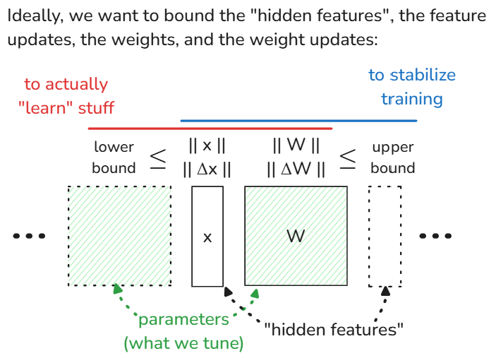
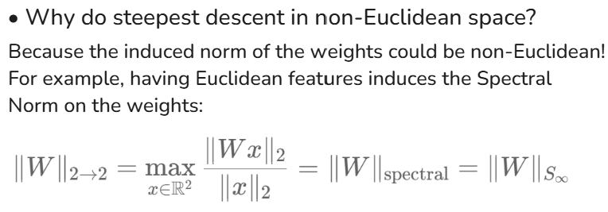
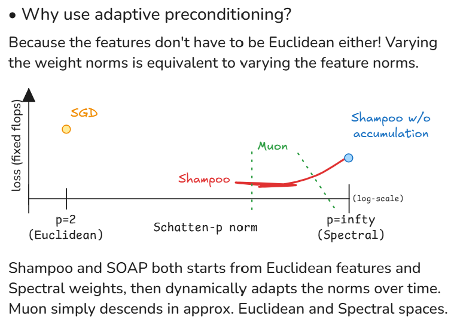

> Note: This was originally posted as a Twitter thread. I've reformatted it here for better readability.

1. Why do steepest descent in non-Euclidean spaces?
2. Why does adaptive preconditioning work so well in practice? And,
3. Why normalize everything ala nGPT?

---

Ideally, when training a neural network, we want to bound the features, the weights, and their respective updates so that:

1. [lower] the model actually "learns" stuff; and
2. [upper] model training is stable

These bounds then depend on the norms, but which norms?

<div align="center">
    
</div>

---

The fun part is that the norms of the input and output features already induce the norm of the weights between them. We can also let the feature and feature updates have the same norm (likewise for the weights). And so, we only have to choose the norms for the features!

<div align="center">
    
</div>

---

Now, our datasets are usually Euclidean or locally Euclidean (see Manifold Hypothesis)

What's the norm induced by Euclidean input and output vector spaces? The Spectral Norm!

<div align="center">
    
</div>

---

So even if we don't want to do anything fancy, we'd still have to do steepest descent in non-Euclidean space because:

1. The induced norm for the weights (w/ Euclidean features) is non-Euclidean; and
2. We're optimizing the weights, not the features.

---

The model inputs and outputs being Euclidean sounds reasonable, but why do the "hidden" features have to be Euclidean too?

If we vary the norms of these features, we also vary the induced norms of the weights and vice versa.

Adaptive preconditioning then "searches" for the proper norms.

<div align="center">
    
</div>

---

This also answers [@mattecapu](https://x.com/mattecapu)'s Q here

Shampoo & SOAP starts from Euclidean features and Spectral weights, then tunes the norms over time. SOAP does this tuning with momentum so it's theoretically faster.

> really cool to also optimize the p in the norm. do you have a conceptual idea of what that's tuning? I guess intuitively as p->oo each dimension is getting 'further away' from each other..

https://x.com/mattecapu/status/1847218617567301804

A more cynical answer, from a mathematician to another, is that almost nobody in this field is actually doing proper linear algebra. Adaptive preconditioning allows us to start from really crappy configurations/parametrizations and get away scoff free.

But a more pro-ML answer would be that humans suck at predicting which inductive biases would work best when cooked into the models. E.g. why should the "hidden" features be in Euclidean space? Why not let the model learn the proper space(s) to work with?

---

Finally, why is it a good idea to normalize everything everywhere?

Cuz it lets us have sane bounds & same norms on the features which means we can use the same optimizer for all the layers with minimal tuning!

https://arxiv.org/abs/2410.01131

## How to Cite

```bibtex
@misc{cesista2024firstordernormedopt,
  author = {Franz Louis Cesista},
  title = {Deep Learning Optimizers as Steepest Descent in Normed Spaces},
  year = {2024},
  url = {http://leloykun.github.io/ponder/steepest-descent-opt/},
}
```

## References

- Loshchilov, I., Hsieh, C., Sun, S., Ginsburg, B. (2024). nGPT: Normalized Transformer with Representation Learning on the Hypersphere. URL https://arxiv.org/abs/2410.01131
- Yang, G., Simon, J., Bernstein, J. (2024). A Spectral Condition for Feature Learning. URL https://arxiv.org/abs/2310.17813
- Bernstein, J., Newhouse, L. (2024). Old Optimizer, New Norm: An Anthology. URL https://arxiv.org/abs/2409.20325
