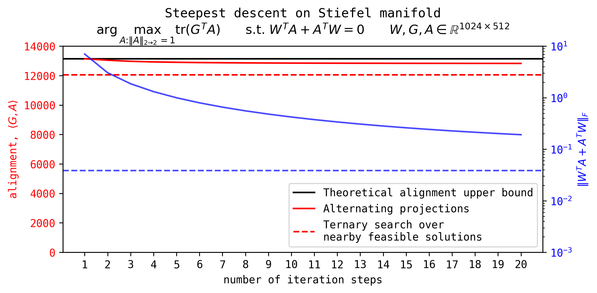

> If you find this post useful, please consider supporting my work by sponsoring me on GitHub: [![Sponsor on GitHub][sponsor-badge]][sponsor-link]

[sponsor-badge]: https://img.shields.io/badge/🤝-Sponsor%20me-1da1f2?logo=github&style=flat-square
[sponsor-link]: https://github.com/sponsors/leloykun

> This is still a Work in Progress (WIP). I've decided to publish this earlier than planned to get feedback and iterate quickly. If you spot any mistakes, please don't hesitate to let me know! Email me at franzlouiscesista@gmail.com or tag me on X ([@leloykun](https://x.com/leloykun)).

## Steepest descent on Stiefel manifold

Consider a weight matrix $W \in \mathbb{R}^{m \times n}$ that is semi-orthogonal, i.e., $W^T W = I_n$. Note that $W \in \text{St}(m, n)$, the Stiefel manifold of $m \times n$ semi-orthogonal matrices. Given a "raw gradient" or differential $G \in \mathbb{R}^{m \times n}$, we want to find the steepest descent direction on the Stiefel manifold, i.e., we want to find a matrix $A^\* \in \mathbb{R}^{m \times n}$ such that,
$$A^\* = \arg\max\_{\\| A \\|\_{2 \to 2} = 1} \text{tr}(G^T A) \quad \text{s.t. } W^T A + A^T W = 0.$$
In words, we want to find a unit spectral norm matrix $A$ that is in the tangent space at $W$ and maximizes the "alignment" with the raw gradient $G$.

## Equivalence between Bernstein's and Su's solutions

Bernstein (2025) and Su (2025) found the following solutions to the square and full-rank case,

$$\begin{align*}
    A^\*\_{\text{bernstein}} &= W \texttt{msign}(\texttt{skew}(W^TG))\\\\
    A^\*\_{\text{su}} &= \texttt{msign}(G - W\texttt{sym}(W^T G))
\end{align*}$$

We will show that these are equivalent, i.e., $A^\*\_{\text{bernstein}} = A^\*\_{\text{su}}$. For this, we will reuse the following proposition we have discussed in a [previous post on spectral clipping](../spectral-clipping).

> **Proposition 1 (Transpose Equivariance and Unitary Multiplication Equivariance of Odd Matrix Functions)**. Let $W \in \mathbb{R}^{m \times n}$ and $W = U \Sigma V^T$ be its reduced SVD. And let $f: \mathbb{R}^{m \times n} \to \mathbb{R}^{m \times n}$ be an odd analytic matrix function that acts on the singular values of $W$ as follows,
> $$f(W) = U f(\Sigma) V^T.$$
> Then $f$ is equivariant under transposition and unitary multiplication, i.e.,
> $$\begin{align*}
    f(W^T) &= f(W)^T \\\\
    f(WQ^T) &= f(W)Q^T \quad\forall Q \in \mathbb{R}^{m \times n} \text{ such that } Q^TQ = I_n \\\\
    f(Q^TW) &= Q^Tf(W) \quad\forall Q \in \mathbb{R}^{m \times n} \text{ such that } QQ^T = I_m
\end{align*}$$

Thus,

$$\begin{align*}
    A^\*\_{\text{bernstein}}
        &= W \texttt{msign}(\texttt{skew}(W^TG)) \\\\
        &= \texttt{msign}(W \texttt{skew}(W^TG)) &\text{(from Proposition 1)} \\\\
        &= \texttt{msign}\left(\frac{1}{2}W W^T G - \frac{1}{2}W G^T W \right) \\\\
        &= \texttt{msign}\left(W W^T G - \frac{1}{2}W W^T G - \frac{1}{2}W G^T W \right) \\\\
        &= \texttt{msign}\left(G - W\texttt{sym}(W^T G) \right) \\\\
    A^\*\_{\text{bernstein}} &= A^\*\_{\text{su}}
\end{align*}$$
where the second-to-last equality relies on $W$ being square and full-rank (which then implies that $W W^T = I\_m$).

## Projection-projection perspective

One can interpret Bernstein's and Su's solutions as a two-step projection process:

1. (Orthogonal) projection to the tangent space at $W$; and
2. Projection to the closest semi-orthogonal matrix.

This is because the map $G \to G - W \texttt{sym}(W^T G)$ is actually the orthogonal projection onto the tangent space at $W$ and that $\texttt{msign}$ projects the resulting matrix to the closest semi-orthogonal matrix. We present these more rigorously as follows.

> **Theorem 2 (Orthogonal projection to the tangent space at $W$).** Let $W \in \text{St}(m, n)$ be a point on the Stiefel manifold. The projection of a vector $V \in \mathbb{R}^{m \times n}$ onto the tangent space at $W$, denoted as $T\_W\text{St}(m, n)$ , is given by,
> $$\begin{equation}
    \texttt{proj}\_{T\_W\text{St}(m, n)}(V) = V - W \text{sym}(W^T V)
\end{equation}$$


> **Proof.** First, we need to show that the normal space at $W$, $\text{NS}\_W$ is given by,
> $$\text{NS}\_W = \\{WS \| S = S^T\\}$$
> for symmetric $S$. To show this, let $A \in T\_W\text{St}(m, n)$ be an arbitrary tangent vector at $W$. Then we have,
> $$\begin{align*}
    \langle A, WS \rangle &= \text{tr}(A^T WS) \\\\
        &= \text{tr}(S W^T A) &\text{(transpose invariance of trace)} \\\\
        &= -\text{tr}(S A^T W) &\text{(since $A \in T\_W\text{St}(m, n)$)} \\\\
        &= -\text{tr}(A^T W S) &\text{(cyclic property of trace)} \\\\
    \langle A, WS \rangle &= -\langle A, WS \rangle
\end{align*}$$
> Thus $\langle A, WS \rangle = 0$ which implies that $A$ and $WS$ are orthogonal. Hence $WS \in \text{NS}\_W$.
>
> Now, for any $V \in \mathbb{R}^{m \times n}$, we can write it as,
> $V = \underbrace{V - WS}\_{\text{candidate tangent}} + \underbrace{WS}\_{\text{candidate normal}}$ for some symmetric $S$. To find $S$,
> $$\begin{align*}
    W^T (V - WS) + (V - WS)^T W &= 0 \\\\
    W^T V - S + V^TW - S &= 0 \\\\
    S &= \text{sym}(W^T V)
\end{align*}$$
> Thus, $V - W \text{sym}(W^T V) \in T\_W\text{St}(m, n)$. And because of that, $W^T (V - W \text{sym}(W^T V))$ must be skew-symmetric. Thus,
> $$\begin{equation*}
    \langle V - WS, WS \rangle
        = \langle \underbrace{W^T (V - WS)}\_{\text{skew-symmetric}}, \underbrace{S}\_{\text{symmetric}} \rangle
        = 0
\end{equation*}$$
> Hence, $V - W \text{sym}(W^T V)$ is the orthogonal projection of $V$ onto the tangent space at $W$.



And from Proposition 4 of Bernstein & Newhouse (2024),

> **Proposition 3 (Projection to the closest semi-orthogonal matrix).** Consider the orthogonal matrices $\mathcal{O}\_{m \times n} := \\{ A \in \mathbb{R}^{m \times n} : A A^T = I\_m or A^T A = I\_n \\}$ and let $\\| \cdot \\|\_F$ denote the Frobenius norm. For any matrix $G \in R^{m \times n}$ with reduced SVD $G = U \Sigma V^T$:
> $$\arg\min\_{A \in \mathcal{O}\_{m \times n}} \\| A - G \\|\_F = \texttt{msign}(G) = UV^T,$$
> where the minizer $UV^T$ is unique if and only if the matrix $G$ has full rank.

Thus we can write,
$$A^\*\_{\text{bernstein}} = A^\*\_{\text{su}} = (\texttt{msign} \circ \texttt{proj}\_{T\_W\text{St}(m, n)})(G)$$

### Why Bernstein's & Su's solutions only work for the square and full-rank case

Note that the projections above aim to guarantee both of our criteria for the solution, but one step at a time. And that the $\texttt{msign}$ after the projection may send the resulting matrix outside the tangent space at $W$. We show that this is not a problem in the square and full-rank case, but it is in the general case.

| operation                                                |              on the tangent space at $W$? |    have unit spectral norm? |
| -------------------------------------------------------- | ----------------------------------------: | --------------------------: |
| (input $G$)                                              |                            not in general |              not in general |
| 1st projection ($\texttt{proj}\_{T\_W St(m, n)}(\cdot)$) |               ${\color{green}\text{yes}}$ |             not necessarily |
| 2nd projection ($\texttt{msign}(\cdot$))                 | only for the square<br>and full-rank case | ${\color{green}\text{yes}}$ |

To demonstrate this, we will need the following proposition.

> **Proposition 4 ($\texttt{msign}$ preserves skew-symmetry).** Let $X \in \R^{m \times n}$ be a skew-symmetric matrix. Then $\texttt{msign}(X)$ is also skew-symmetric.

The proof follows directly from the transpose equivariance and oddness of $\texttt{msign}$, i.e., $\texttt{msign}(X) = \texttt{msign}(-X^T) = -\texttt{msign}(X)^T$.

Also note that for the general case,
$$\begin{equation}
    WW^T + QQ^T = I\_m \quad\text{and}\quad W^T Q = 0
\end{equation}$$
where $Q$ is the orthogonal complement of $W$.

Thus,
$$\begin{align*}
    (\texttt{msign}\circ \texttt{proj}\_{T\_W St(m, n)})(G)
        &= \texttt{msign}(G - \frac{1}{2}W W^T G - \frac{1}{2} W G^T W) \\\\
        &= \texttt{msign}((WW^T + QQ^T)G - \frac{1}{2}W W^T G - \frac{1}{2} W G^T W) \\\\
        &= \texttt{msign}(W \texttt{skew}(W^T G) + QQ^T G)
\end{align*}$$
For the square and full-rank case, we have $Q = 0$. And the above simplifies to Berstein's solution,
$$(\texttt{msign}\circ \texttt{proj}\_{T\_W St(m, n)})(G) = W \texttt{msign}(\texttt{skew}(W^T G))$$
and since $\texttt{skew}(W^T G)$ is skew-symmetric, then $\texttt{msign}(\texttt{skew}(W^T G))$ must be too. And thus,
$$\begin{align*}
    &W^T (\texttt{msign}\circ \texttt{proj}\_{T\_W St(m, n)})(G) + (\texttt{msign}\circ \texttt{proj}\_{T\_W St(m, n)})(G)^T W \\\\
        &\qquad= W^T W \texttt{msign}(\texttt{skew}(W^T G)) + (W\texttt{msign}(\texttt{skew}(W^T G)))^T W \\\\
        &\qquad= \texttt{msign}(\texttt{skew}(W^T G)) + \texttt{msign}(\texttt{skew}(W^T G))^T \\\\
        &\qquad= 0
\end{align*}$$
Hence for the square and full-rank case, this two-step projection process guarantees that the resulting matrix has unit spectral norm *and* is in the tangent space at $W$.

For the more general case, we have $Q \neq 0$. Thus, we cannot guarantee that $W \texttt{skew}(W^T G) + QQ^T G$ is skew-symmetric. And so the $\texttt{msign}$ after the projection may send the resulting matrix outside the tangent space at $W$.

### Heuristic solution for the general case [Under Construction]

Notice that $QQ^T G$ is the projection of $G$ onto the column space of $Q$, $\texttt{proj}\_{\text{col}(Q)}(G) = QQ^T G$. One can think of this as the component of $G$ that is not in the span of $W$. In practice, this is typically small relative to the component of $G$ that *is* in the span of $W$. If so, then,
$$(\texttt{msign}\circ \texttt{proj}\_{T\_W St(m, n)})(G) \approx \texttt{msign}(W \texttt{skew}(W^T G) + \cancel{\texttt{proj}\_{\text{col}(Q)}(G)})$$
which means that while the resulting matrix after the two projections may not be in the tangent space at $W$, it would likely be *nearby*. And repeating this process a few times should close the gap.

Here's a sample implementation,
```python
def project_to_stiefel_tangent_space(X, delta_X):
    return delta_X - X @ sym(X.T @ delta_X)

def orthogonalize(X):
    # copy Newton-Schulz iteration from Muon (Jordan et al., 2024)

def steepest_descent_stiefel_manifold_heuristic(W, G, num_steps=1):
    assert num_steps > 0, "Number of steps must be positive"
    A_star = G
    for _ in range(num_steps):
        A_star = project_to_stiefel_tangent_space(W, A_star)
        A_star = orthogonalize(A_star)
    return A_star
```

## Results [Under Construction]



## How to cite

```bibtex
@misc{cesista2025spectralclipping,
  author = {Franz Louis Cesista},
  title = {"A Simple Heuristic Solution for Steepest Descent on Stiefel Manifold"},
  year = {2025},
  url = {http://leloykun.github.io/ponder/steepest-descent-stiefel/},
}
```

> If you find this post useful, please consider supporting my work by sponsoring me on GitHub: [![Sponsor on GitHub][sponsor-badge]][sponsor-link]

[sponsor-badge]: https://img.shields.io/badge/🤝-Sponsor%20me-1da1f2?logo=github&style=flat-square
[sponsor-link]: https://github.com/sponsors/leloykun

## References

1. Jeremy Bernstein (2025). Orthogonal manifold. URL https://docs.modula.systems/algorithms/manifold/orthogonal/
2. Jianlin Su (2025). Steepest descent on Stiefel manifold. URL https://x.com/YouJiacheng/status/1945522729161224532
3. Jeremy Bernstein, Laker Newhouse (2024). Old Optimizer, New Norm: An Anthology. URL https://arxiv.org/abs/2409.20325
4. Keller Jordan, Yuchen Jin, Vlado Boza, Jiacheng You, Franz Cesista, Laker Newhouse, and Jeremy Bernstein (2024). Muon: An optimizer for hidden layers in neural networks. Available at: https://kellerjordan.github.io/posts/muon/
