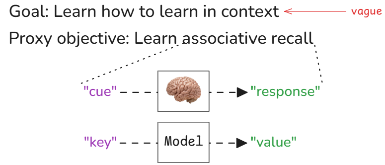
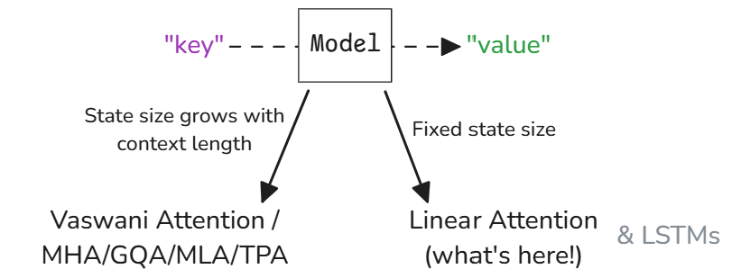
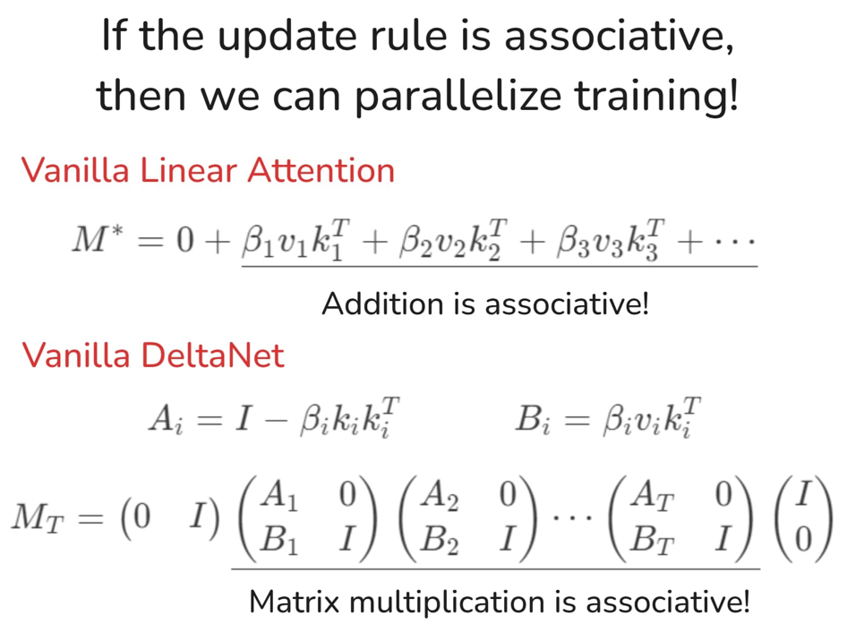

> Note: This was originally posted as a Twitter thread. I've reformatted it here for better readability.

By now, you've probably already heard of linear attention, in-context learning, test-time scaling, and etc...

Here, I'll discuss:

1. The unifying framework that ties them all together;
2. How to derive different linear attention variants from scratch; and
3. How to parallelize training linear attention models

## Learning how to learn in-context

First, what do we want from an *ideal* language model?

1. **In-context learning**: *At inference time*, we want the model to learn from information it has ingested so far and use that information to make more accurate predictions moving forward.

2. **Computational expressivity**: We want it to have a complex-enough internal machinery so it can actually solve hard problems we encounter in real-life. And

3. **Efficiency**.

Of course, there are other stuff we'd want. But these are the most important ones. And here, we'll focus on the first one.

### Associative Recall

To teach the models to learn in context, let's steal an idea from nature: **Associative Recall**

- Mom's cooking triggers memories of my childhood
- Live wires remind me of the time I got electrocuted

That's associative recall.

<div align="center">
    
</div>

A "cue" goes into the brain and a "response" comes out. And the brain learns this "cue"-"response" mapping automatically through experience.

We want our models to learn how to do this too. But in practice, we call the "cue" the "key" and the "response" the "value" (following the Attention is All You Need$^{[1]}$ paper).

---

From here, we have a (major) architectural design decision to make: Either we let the model's "state" grow with the context length, or... we fix it at a certain size.

The former allows us to keep as much information as we can as we chug through the context. This, in turn, helps with the model's expressivity as there is little to no information loss.

The latter, on the other hand, is *much* more efficient at the cost of expressivity. There's an upper limit on how much information we can store in this state. And there's also the question of *how* we're gonna teach the model to learn which information are important enough to store and which to discard.

<div align="center">
    
</div>

For the rest of the thread, I'll focus on linear attention... I'll make another thread for the former case (stay tuned!).

### Heirarchical optimization process with (linear) attention mechanisms

Now, another design decision we need to make is how to map the input context into key-value pairs.

Interestingly, this results in a two-layer optimization process:

1. The "outer model" optimizes the mapping from the input context into key-value pairs.

2. While the "inner model" treats the outer model as a black box and simply optimizes its state to better predict the values from the keys.


And with more modern optimizers, such as Shampoo/PSGD, you can actually think of this as a three-layer optimization process because:

3. The optimizer is also trying to learn the geometry of the loss landscape by adjusting the gradient preconditioners.

## Deriving linear attention Mechanisms from first principles

If the "inner model" is optimizing something, then what is it optimizing? Again, we need to make another design decision here on which loss function to use. But which one is the most appropriate?

To simulate associative recall, we want the model to learn a mapping from the keys to the values. In other words, we want to learn a function:

$$M : \text{key} \rightarrow \text{value}$$

Thus, we need to define a distance metric between the model's prediction and the actual value:

$$\text{loss}_M(\text{key}, \text{value}) = \text{distance}(M(\text{key}), \text{value})$$

Question is, how do we define this "distance"?


In practice, we've pretty much settled on two of the most basic distance metrics:

1. The **negative dot product**. Minimizing this is equivalent to maximizing the dot product or the "alignment" between $Mk$ and $v$.
2. The **(squared) Euclidean distance**. Minimizing this is equivalent to doing (linear) regression between the keys and the values.

---


From here, we can add the tricks we've learned so far from designing optimizers one-by-one to arrive at different variants of linear attention.

- If we pick the negative dot product loss and do online gradient descent, we'll get Vanilla Linear Attention.
  - If we add a data-independent weight decay, we'll get Lightning Attention 2 that's used in the MiniMax-O1 paper.
  - If we make the weight decay data dependent instead, we'll get Mamba 2 that was all the rave last year.
- Now, if we pick the Euclidean loss instead, we'll get the Vanilla DeltaNet.
  - If we add a data-dependent weight decay, we'll get Gated DeltaNet.
  - Then we fork from here:
    - If we use non-linear key -> value transforms, we'll get TTT.
    - But if we add a momentum term instead, we'll get the newly released Titans.

## How to design flash kernels for linear attention mechanisms

Let's go back to my claim earlier that linear attention mechanisms are more efficient. This is clearly true at inference time because, unlike (Vaswani) Softmax Attention, we don't need to loop through all the previous key-value pairs to make a prediction--we only need to update the state with the new key-value pair and use that updated state to make a prediction.

But what about at training time? Can we parallelize training of linear attention mechanisms?

Remember: the primary reason pretty much everyone dropped RNNs in favor of (Vaswani) Softmax Attention is that the latter is very easy to parallelize. Thus, we can scale it up better. And scale is, often times, all you need.

### A sufficient condition for parallelizing training

As a rule of thumb, if you can recast your update rule as an associative operation over sequences, then you can parallelize it! This is, of course, only a sufficient, but not necessary, condition. There are non-associative operations that can be parallelized too with Chunk-wise parallelism.

<div align="center">
    
</div>

Note that there are faster ways to implement DeltaNet's update rule (e.g. WY representations, etc.). We'll discuss that next time!

### Computational forms of paralleled training

In practice, how do we actually calculate the running "sums" efficiently? Remember those leetcode job interview data structure questions you hate? Well... this is when they become relevant...

<div align="center">
    
</div>

The most naive way is to simply run a loop through the key-value pairs. This is the **recurrent form**, and this is what we should be doing at inference time. But we can do much better than this.

On the other extreme end is the **fully-parallel associative scan** where we first aggregate the running sums by powers of two, then do a second pass to propagate the running sums across the sequence. If you've implemented a Fenwick Tree before, this is roughly how it works.

But in practice, we use **chunk-wise parallelism** where we:

1. Divide the sequence into chunks.
2. Use fully-parallel associative scan within each chunk. And
3. Use the recurrent form to propagate running sums across chunks.

---

That's it for now. Next time, I plan to talk about:

1. How to derive different attention mechanisms using tensor string diagrams.
2. Circuit complexity of different attention mechanisms.
3. LLM reasoning.

Stay tuned!

## How to Cite

```bibtex
@misc{cesista2025linearattn,
  author = {Franz Louis Cesista},
  title = {({L}inear) {A}ttention as {T}est-{T}ime {R}egression},
  year = {2025},
  url = {https://leloykun.github.io/ponder/test-time-regression/},
}
```

## References

1. Vaswani, A., Shazeer, N., Parmar, N., Uszkoreit, J., Jones, L., Gomez, A. N., ... & Polosukhin, I. (2017). Attention is all you need. URL https://arxiv.org/abs/1706.03762
2. Gupta, V., Koren, T., & Singer, Y. (2018). Shampoo: Preconditioned Stochastic Tensor Optimization. URL https://arxiv.org/abs/1802.09568
3. Wang, K., Shi, J., Fox., E. (2025). Test-time regression: a unifying framework for designing sequence models with associative memory. URL https://arxiv.org/abs/2501.12352
4. Yang, S. (2025). What’s Next for Mamba? Towards More Expressive Recurrent Update Rules. URL https://sustcsonglin.github.io/assets/pdf/talk_250117.pdf
5. Angelos Katharopoulos, Apoorv Vyas, Nikolaos Pappas, and François Fleuret. Transformers are rnns: Fast autoregressive transformers with linear attention. In Proceedings of the 37th International Conference on Machine Learning, ICML 2020, 13-18 July 2020, Virtual Event, volume 119 of Proceedings of Machine Learning Research, pp. 5156–5165. PMLR, 2020b. URL http://proceedings.mlr.press/v119/katharopoulos20a.html.
4. Tri Dao and Albert Gu. Transformers are SSMs: Generalized models and efficient algorithms through structured state space duality. In Proceedings of the 41st International Conference on MachineLearning, volume 235 of Proceedingsof Machine Learning Research, pp. 10041–10071. PMLR, 2024b. URL https://proceedings.mlr.press/v235/dao24a.html.
5. Songlin Yang, Bailin Wang, Yu Zhang, Yikang Shen, and Yoon Kim (2025). Parallelizing Linear Transformers with the Delta Rule over Sequence Length. URL https://arxiv.org/abs/2406.06484
6. Songlin Yang, Jan Kautz, Ali Hatamizadeh (2025). Gated Delta Networks: Improving Mamba2 with Delta Rule. URL https://arxiv.org/abs/2412.06464
7. Weizhe Hua, Zihang Dai, Hanxiao Liu, and Quoc V. Le. Transformer quality in linear time. In Kamalika Chaudhuri, Stefanie Jegelka, Le Song, Csaba Szepesvári, Gang Niu, and Sivan Sabato (eds.), International Conference on Machine Learning, ICML 2022, 17-23 July 2022, Baltimore, Maryland, USA, volume 162 of Proceedings of Machine Learning Research, pp. 9099–9117. PMLR, 2022b. URL https://proceedings.mlr.press/v162/hua22a.html.
8. Yutao Sun, Li Dong, Shaohan Huang, Shuming Ma, Yuqing Xia, Jilong Xue, Jianyong Wang, and Furu Wei. Retentive network: A successor to transformer for large language models. ArXiv preprint, abs/2307.08621, 2023. URL https://arxiv.org/abs/2307.08621.
